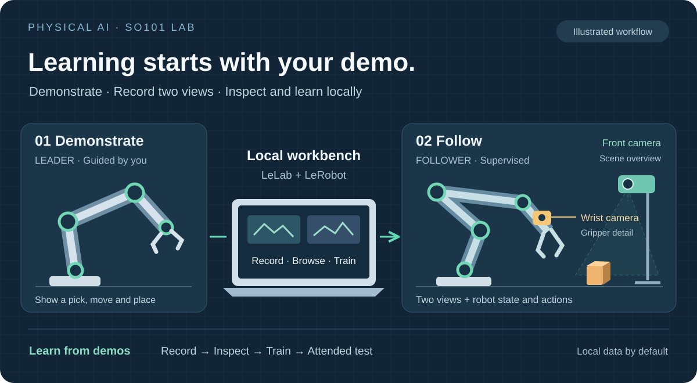
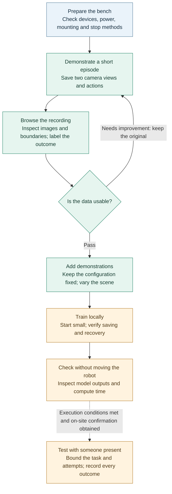
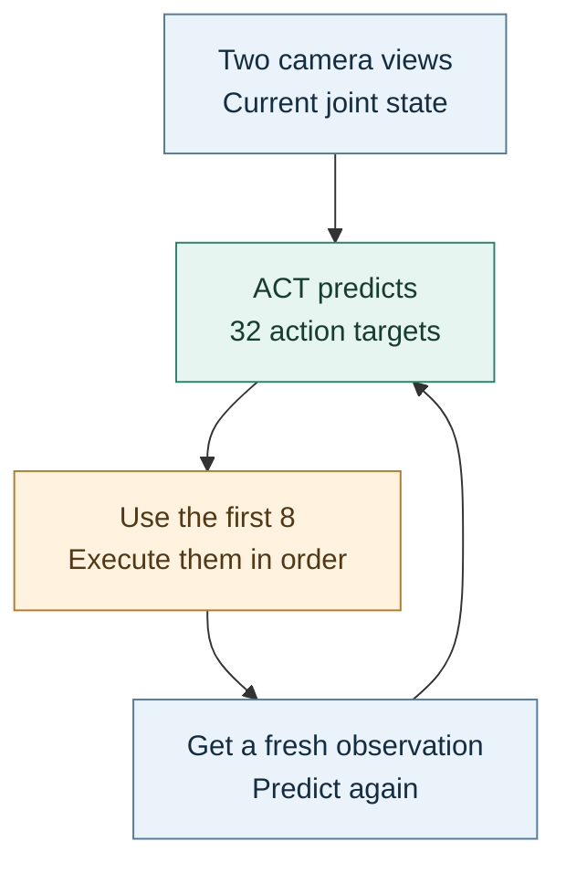

<div align="center">

[简体中文](README.md) · **English**

# PhysicalAI SO101 Lab

**A robot's learning journey starts with your demonstration.**

`Local on Windows` · `SO-ARM101` · `Two cameras` · `ACT imitation learning`

[Quick start](#quick-start) · [Features](#what-you-can-use-today) · [Imitation learning](#setting-up-imitation-learning) · [Progress](#what-has-actually-been-verified) · [Documentation](#find-the-guide-you-need)

</div>



<p align="center"><sub>Illustration of device roles and the learning workflow — not a hardware photo, scale drawing or autonomous sorting result</sub></p>

Guide the leader arm through a pick-and-place task. The follower follows your demonstration,
while a wrist camera records the details and a front camera watches the whole scene.

This project brings **demonstration, data inspection and imitation learning** into one local workbench,
built on the official [LeLab](https://github.com/huggingface/leLab) interface and
[LeRobot](https://github.com/huggingface/lerobot) robotics and learning tools.
You can start with a CPU for recording, browsing and small training checks; cloud services and ROS 2 are not prerequisites.

> [!IMPORTANT]
> Real two-camera recording, data readback and checkpoint recovery have been verified.
> **Autonomous pick-and-place and color sorting have not been verified on the robot.** This is a learning lab, not an out-of-the-box sorting system.

This README is available in Chinese and English. The linked detailed guides are currently in **Chinese**;
the language switch changes the README, not the language of the workbench or those guides.

### Where would you like to start?

| First time here | Already have recordings | Moving to another computer |
|---|---|---|
| Install the workbench and open it with one launcher | Inspect your data, then try a short training run | Rebuild the environment and restore your private files separately |
| [Quick start](#quick-start) | [Imitation learning](#setting-up-imitation-learning) | [Migration checklist — Chinese](docs/GETTING_STARTED.md#迁移到另一台电脑) |

## Quick start

### 1 · Install once

You will need Windows 11, PowerShell, [Git](https://git-scm.com/downloads),
[uv](https://docs.astral.sh/uv/getting-started/installation/) and [Node.js](https://nodejs.org/en/download) 22.13 or newer
(Node.js 24 has been verified). Setup uses uv to manage Python 3.12. The first installation needs an internet connection.

Run these commands in PowerShell:

```powershell
git clone https://github.com/sgyliu8/LeRobot.git PhysicalAI-SO101-Lab
Set-Location .\PhysicalAI-SO101-Lab
.\Start-SO101-Lab.cmd setup
.\Start-SO101-Lab.cmd check
.\Start-SO101-Lab.cmd open
```

Setup installs the pinned dependencies and builds the interface. It does not calibrate or move the robot.
Open the workbench at [http://127.0.0.1:8000/](http://127.0.0.1:8000/); the service listens only on the local computer.
A working page does not mean that the hardware is ready.

### 2 · After that, double-click one file

Double-click **[Start-SO101-Lab.cmd](Start-SO101-Lab.cmd)** in the project folder, then press Enter.
You can keep a desktop shortcut to this file as the project is updated.

```powershell
.\Start-SO101-Lab.cmd open
```

<details>
<summary>Everyday commands: check, logs, stop and update</summary>

| I want to… | Command |
|---|---|
| Open the workbench | Press Enter in the launcher, or run `.\Start-SO101-Lab.cmd open` |
| Check the environment and CPU/GPU availability | `.\Start-SO101-Lab.cmd check` |
| Inspect service status or logs | `.\Start-SO101-Lab.cmd status` / `.\Start-SO101-Lab.cmd logs` |
| Stop this project's service | `.\Start-SO101-Lab.cmd stop` |
| Update the project | `.\Start-SO101-Lab.cmd update` |

</details>

Opening the workbench does not upgrade dependencies, download models or start motion.
Finish any active tasks normally in the interface, then stop the service before updating.
If another application owns the port, the launcher will not kill it.
See [installation and everyday use — Chinese](docs/GETTING_STARTED.md) for details.

## What you can use today

**Demonstrate and record.** Use leader–follower teleoperation with two cameras, and explicitly choose how to end a recording.

**Inspect and learn.** Browse local episodes, check their boundaries, train ACT and resume from a complete training checkpoint.

**Keep the lab usable.** Use the quick launcher, check the available CPU/GPU, and prepare a color-sorting experiment with task-specific data tools.

<details>
<summary>All nine capabilities and where to find them</summary>

These features have code and usable entry points; this is not a list of proposed features.
Software implementation and real-robot validation are reported separately.

| Capability | What is implemented | Where to use it |
|---|---|---|
| Quick launcher | Setup, updates, environment checks, logs and controlled service shutdown; no reinstall on every launch | `Start-SO101-Lab.cmd` |
| Teleoperation and two cameras | The official leader–follower workflow with wrist and front views; motion still requires on-site confirmation | LeLab device settings and Teleoperate |
| Recording controls | FPS, encoding and target-limit settings; distinct Accept, Timeout, Discard and Stop outcomes without unlimited automatic re-recording | Record |
| Local data inspection | Two-view browsing and episode/video boundary checks; inspection does not silently repair or delete originals | Browse / `tools/audit_dataset.py` |
| ACT training | Local dataset selection, steps, batch size, action-chunk settings and data-loading preflight checks | Training |
| Compute-device selection | Detect and record the device actually available to the environment; no automatic GPU-runtime installation | Check / Advanced → Device |
| Checkpoints and recovery | Distinguish readable model files from full resume files; resume into a new job | Jobs |
| Color-sorting tools | Task preset, saved-frame color inspection, human labels, session-based splits and training-only statistics | Record / Training; Browse summaries; local commands in the [task guide — Chinese](docs/TASK_COLOR_SORTING.md) |
| Hardware ownership | One owner at a time, cached status reads and protection against an old task's cleanup stopping a new task | Runtime checks and hardware-isolated tests; not a safety certification |

</details>

Color-region configuration and labels are maintained through local files and commands.
There is no graphical region-labeling editor or live color-based controller.
Appending recordings has passed synthetic tests, but the real recording-resume workflow has not yet been validated.
See the [project status — Chinese](docs/PROJECT_STATUS.md) for the exact evidence boundaries.

## A learning lab on one table

You guide the **leader**; the **follower** performs the demonstrated movement.
The wrist camera sees the grasp, while the front camera sees the scene.
This is one leader and one follower, not two independently acting robot arms.

<details>
<summary>Device roles and camera names</summary>

| Part | Role |
|---|---|
| Leader arm | The arm you move to demonstrate a task |
| Follower arm | The arm that follows the demonstration under supervision |
| Wrist camera — `arm` | Close-up view near the follower's wrist or gripper |
| Front camera — `table_veiw` | Fixed view of the tabletop scene |
| Computer | Runs LeLab and LeRobot to record, inspect and learn locally |

</details>

Keep the camera keys `arm` and `table_veiw` unchanged in existing datasets.
The spelling of `table_veiw` is retained for compatibility; the human-readable role is **front**.

## From a demonstration to a meaningful test

**Demonstrate and record → inspect → add varied examples → train briefly → check offline → test with someone present.**

Start with one short episode, not hundreds. Inspect it before collecting more.
The final step requires a separate, attended hardware session.

<details>
<summary>View the complete learning workflow</summary>



</details>

**Record:** you move the leader. Freeze the camera keys, resolution, dataset FPS and joint units before creating the dataset.
640 × 480 at a dataset rate of 15 Hz is a starting candidate, not a verified capture rate for every camera.
Camera capture timing must be measured separately. If calibration is already valid, there is no need to repeat it just to start again.

**Inspect:** check both videos, episode boundaries and the human-labeled outcome. An episode is one complete attempt.
The seventh episode should read **`Episode 7 of 7 · dataset index 6`**: the display counts from 1, while the stored index starts at 0.
A technically valid recording does not prove that the task succeeded.

**Append:** use the exact dataset ID returned by the first recording and the same profile through the official resume path.
Do not join files by hand; retain failed and aborted attempts.

**Train:** start with ACT and a bounded action chunk. Verify data loading, saving and recovery before a long run.
Finishing training does not mean the robot has learned the task.

Follow the [data workflow — Chinese](docs/DATA_WORKFLOW.md) for detailed steps.

## Setting up imitation learning

### What does the model learn from a demonstration?

It is not simply replaying a video. ACT takes **two RGB views and a six-dimensional robot state**,
and learns to predict the action targets recorded during demonstrations.
At inference time, a fresh observation produces a short sequence of targets.

An action target is not a measurement of the position the robot actually reached.
The gripper value is a normalized position, not a distance in millimeters.

Task text, color observations and human outcome labels organize, filter and evaluate the data;
they are not automatically inputs to ordinary ACT.
Writing “put it in the red bin” does not, by itself, make the model language-conditioned.

<details>
<summary>Why predict 32 targets but execute only 8?</summary>

The following illustrates a **32 / 8 candidate configuration**, not a verified real-robot result.



32 is the number of targets predicted at once; 8 is the prefix used from that prediction.
Neither is an episode count or a joint count. Unused targets are not sent later to catch up;
the next sequence is calculated from a new observation.
Both lengths must be positive integers, and **the execution prefix cannot exceed the prediction chunk**.

</details>

Before running on hardware, check compute time, action units and on-site conditions.
A 32 / 8 setting does not guarantee real-time performance or safe motion.

### Your first setup: make a short training run work

1. **Prepare the data first.** Finish recording and finalization, inspect it in Browse, then verify readback using the
   [data workflow — Chinese](docs/DATA_WORKFLOW.md). The color task also requires human labels and frozen training,
   validation and test groups by recording session. Do not split adjacent frames from one session across the three groups.
   The first color baseline admits only human-verified, successful demonstrations without intervention;
   failed and aborted attempts remain in the records and outcome counts.
2. **Choose local training.** Open Training and select `Local — your machine (free)` under Compute target.
   Set Dataset Repository ID to the exact local dataset ID and Policy to ACT.
   “Repository” in the field name does not mean you must upload anything.
3. **Choose the task path.** Once the color dataset is ready, click `Use color sorting candidate (32 / 8)`.
   This also enables the color-task split checks. For ordinary pick-and-place data, do not use that task button;
   enter short-run settings manually instead.
4. **Check the table before starting.** The button changes only the listed settings; it does not reset every option
   you previously changed. On a CPU, first try 1–2 steps with batch 1 to check resources and saving,
   then decide whether to run the 100-step candidate. If you reduce the step count, reduce the save interval accordingly.

| UI setting | Candidate value set by the color-task button | What it means |
|---|---|---|
| Training Steps | `100` | 100 model updates, not 100 recorded episodes or a promise that training is complete |
| Batch Size | `2` | 2 training samples per update; reduce to 1 first if memory is limited |
| Number of Workers (Advanced) | `0` | No extra data-loading processes, simplifying Windows / CPU troubleshooting |
| Prediction chunk size | `32` | How many consecutive action targets to predict at once |
| Execution prefix | `8` | How many targets to use from each prediction; setting this does not connect the robot during training |
| Save Frequency (Advanced) | `100` | How often, in training steps, to save a checkpoint |
| Validation loss every N steps | `100` | Check error on held-out validation data; `0` disables this, and it does not run a robot evaluation |
| Image augmentation | Off | Avoid processing that changes the color cues needed for the task |

**Also check manually:** in Advanced, set Device to Auto, enable Save Checkpoints and Use Policy Training Preset,
and disable Automatic Mixed Precision for the first CPU check.
Keep Weights & Biases disabled under Run Configuration.
For a short run, set Advanced → Log Frequency to `1` or `10`; the default interval of 250 steps can hide intermediate metrics.

> [!WARNING]
> **Do not start with the ordinary form's long-run defaults.** A fresh form currently uses 10000 steps, batch 8 and workers 4.
> Leaving the two action-chunk fields blank uses the pinned upstream defaults of 100 / 100, not 32 / 8.
> The color-task button does not create data or splits. It refuses to start without a frozen split;
> old pick-and-place recordings cannot simply be treated as color-sorting demonstrations.

Start with the policy's learning-rate preset. Do not infer the effective value from the Optimizer dropdown alone.
See [effective ACT settings — Chinese](docs/POLICIES.md#训练设置与有效配置) for preset values, the first weight download,
image processing and detailed parameters. Local training does not require a Hub login just to save results,
but the first run may download public image-backbone weights. **No data upload is not the same as always offline.**

### After training: what to inspect and how to continue

- **Inspect the job and logs.** Confirm the actual device, step count and metrics. Lower training loss is not a higher real-robot success rate.
- **Inspect the checkpoint.** Think of a checkpoint as a saved training state. `model ready` means model files are readable;
  `model + resume files ready` means a static check found the full recovery files. Actual loading still needs verification.
- **Resume from that checkpoint.** Select it in the local Jobs checkpoint menu and use the resume control.
  `Resume to global training step` is the final total step count: to continue from 1000 to 1002, enter `1002`, not `2`.
  Resuming creates a new job without overwriting its source. It uses the saved data configuration, model architecture and training state,
  not the new-training form as an override.
- **Check offline before testing on site.** Verify full loading, outputs and latency. Model control needs a separate on-site confirmation;
  robot replay and inference controls are not read-only model viewers.

The existing 1000 → 1002 recovery experiment used the earlier pick-and-place task.
It verifies the recovery path, **not a trained color-sorting policy**.

## What has actually been verified?

This table separates **existing evidence** from **the next experiments**, rather than using development version numbers as a measure of progress.

| Verified evidence | What it does not establish |
|---|---|
| Leader–follower calibration, bounded teleoperation and both camera roles | Safe operation in every pose or over long periods |
| 7 real two-view episodes, reopened and read back with official data tools | That all 7 tasks succeeded, or that real recording-resume acceptance is complete |
| CPU training resumed from step 1000 to 1002, then saved and loaded again | A fully trained policy or readiness to control the robot |
| Color-task configuration, labels, data splits and training-parameter flow | Captured color-sorting demonstrations or autonomous sorting |
| A real episode driving a simulated arm's pose replay | Validated dynamics, collisions or real-world task performance |

A complete training baseline, color-task training and real-robot evaluation are still unfinished.
See [project status — Chinese](docs/PROJECT_STATUS.md) for detailed scope and limitations.

## Next: sorting cubes by color

The goal is simple: **put each cube in the bin of the same color**.
Start with one cube; solving one pick does not prove the robot can clear a whole table.

| Stage | How the scene changes | What to evaluate |
|---|---|---|
| ① One cube | A randomly chosen color, with three fixed bins | Can it pick up the cube and place it in the correct bin? |
| ② A few cubes | Separate cubes with an explicit selection rule | Can it reliably select the next target? |
| ③ Several cubes | A bounded, whole-scene attempt | The complete outcome, including what happens after failures |
| ④ Rearranged bins | Bin positions change | Has it learned color matching or just fixed locations? |

The workbench includes a `color_sorting_v1` task preset. **None of these four physical stages has been verified yet.**
Actual colors, dimensions and layout must come from the on-site configuration.
The earlier pick-and-place recordings are not demonstrations of this new task.

The color observer can help inspect saved frames and returns “unknown” when the view is inconclusive.
A cube disappearing is not sufficient evidence of success, and the observer does not turn ordinary ACT into a model
that understands arbitrary text instructions.

Start with the [color-sorting guide — Chinese](docs/TASK_COLOR_SORTING.md) and
[ACT concepts and settings — Chinese](docs/POLICIES.md).

## CPU-only use and moving to another computer

**You can start on the computer you have.** A CPU supports software operation, data readback and small training checks;
long training runs will be slow. Measure two-camera recording throughput on the actual setup rather than judging it by a smooth-looking page.

The training device defaults to **Auto**. It selects an accelerator actually usable by the current environment,
or falls back to the CPU when no supported GPU is available.
Having a graphics card is not proof that training is using it; check the environment report and the job's actual device.

When moving computers, transfer these two parts separately:

| Get from GitHub | Restore from your own private backup |
|---|---|
| Code, launcher, pinned dependencies and documentation | Datasets, models, job records, local configuration and calibration for your hardware |
| Run Setup → Check on the new computer | Verify file integrity, then browse, read back and test recovery |

Do not copy the old `.venv` or process records. A GPU computer needs a compatible PyTorch build;
automatic detection does not silently install GPU runtimes. Run Check again after Setup / Update,
because the locked installation may restore a CPU build.
Actual operation on another physical computer and a GPU still needs validation; compatibility with every host is not promised.

Follow the [migration checklist — Chinese](docs/GETTING_STARTED.md#迁移到另一台电脑).

## Before anything moves

- **A working page is not a safety check.** USB connections and live images do not confirm correct power, mounting or a clear workspace.
- **Prepare an independent way to stop.** Software Stop is neither physical power isolation nor a certified emergency stop.
- **Browsing recordings does not move the robot.** Physical action replay and model control require their own on-site confirmation.
- **Keep the local originals.** Videos, datasets, calibration, logs and models stay out of this repository. Recording uploads are disabled by default;
  cloud training and uploads require a separate decision.

Before any physical motion, read the [hardware checklist — Chinese](docs/HARDWARE.md) and
[safety guide — Chinese](docs/SAFETY.md) in full.
This is a supervised learning lab, not an industrial safety-control system.

## Who is making this a usable lab?

**[@sgyliu8](https://github.com/sgyliu8)** initiated the project and conducts the physical experiments:

- Built the leader–follower and two-camera bench, completed calibration and teleoperation, and collected real demonstrations.
- Raised issues through hands-on use: confusing episode numbers, CPU training failures and how to continue after interrupted training.
- Drove the development of a lasting quick launcher, environment checks and a migration workflow, beyond merely making code run.
- Verified improvements through real data readback and recovery experiments, and defined the color-sorting task and its acceptance boundaries.

**LeLab provides the interface; LeRobot provides the robotics and learning capabilities. This project connects them into a practical local SO101 workflow.**
We maintain pinned versions, necessary patches, data checks and operating guides, not a replacement driver, dataset format or training framework.

To report a problem or contribute, read the [development guide — Chinese](docs/DEVELOPMENT.md) or open an
[issue](https://github.com/sgyliu8/LeRobot/issues). Include reproducible steps and a sanitized error summary,
not raw videos, calibration, credentials or complete private logs.

## Find the guide you need

The detailed guides below are currently in **Chinese**. This English README covers the entry workflow and first imitation-learning settings.

| I want to… | Read this |
|---|---|
| Install, open, update or move computers | [Getting started](docs/GETTING_STARTED.md) |
| Check arms, cameras and conditions for motion | [Hardware](docs/HARDWARE.md) · [Safety](docs/SAFETY.md) |
| Record, append, inspect or train | [Data workflow](docs/DATA_WORKFLOW.md) · [Data fields and timing](docs/DATA_CONTRACTS.md) |
| Configure my first imitation-learning run | [Settings in this README](#setting-up-imitation-learning) · [Effective ACT configuration](docs/POLICIES.md#训练设置与有效配置) |
| Start the color task or understand policy choices | [Color sorting](docs/TASK_COLOR_SORTING.md) · [Policy guide](docs/POLICIES.md) |
| Troubleshoot or check what has been verified | [Troubleshooting](docs/TROUBLESHOOTING.md) · [Project status](docs/PROJECT_STATUS.md) |
| Change code, run tests or rebuild patches | [Architecture](docs/ARCHITECTURE.md) · [Development](docs/DEVELOPMENT.md) |

<details>
<summary>Further learning: simulation replay, ROS 2 and visual geometry</summary>

- [MuJoCo replay](examples/mujoco/README.md): a real episode has driven a pose replay; this does not validate dynamic sorting.
- [Read-only ROS 2 replay](integrations/ros2/README.md): inputs and instructions are prepared; actual ROS execution has not been run.
- [Visual geometry experiments](experiments/vision_geometry/README.md): measurement and calibration preparation, awaiting physical dimensions and on-site images.

These guides are also in Chinese. None is a prerequisite for your first installation or recording.

</details>

## Upstream projects and licensing

Thanks to the authors and communities of [Hugging Face LeLab](https://github.com/huggingface/leLab) and
[LeRobot](https://github.com/huggingface/lerobot). Exact dependency identities are recorded in the
[upstream pins](configs/upstream-pins.json). Upstream code retains its own licenses and attribution.

This is not an official Hugging Face repository. No single license has yet been declared for this project's original work;
do not assume unrestricted redistribution. The public repository contains code, non-sensitive configuration, documentation
and original illustrations, not real household footage or private experimental data.

<div align="center">

[Back to top ↑](#physicalai-so101-lab) · [Get started](#quick-start) · [All guides](#find-the-guide-you-need) · [简体中文](README.md)

</div>
