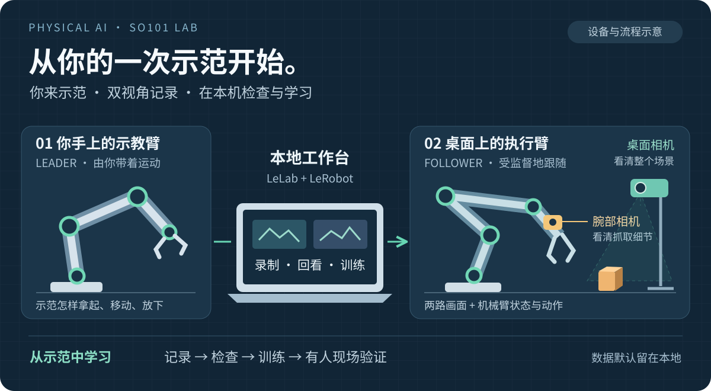
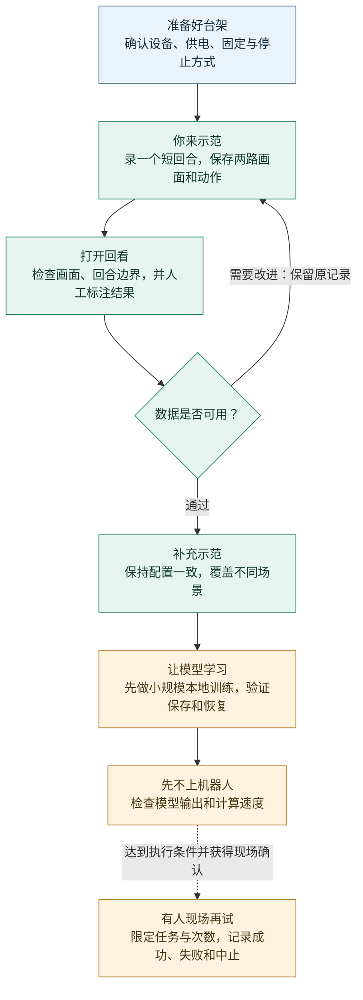
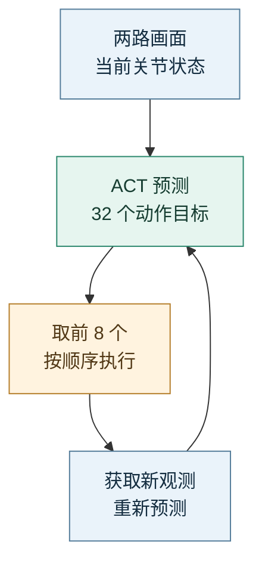

<div align="center">

# PhysicalAI SO101 Lab

**从你的一次示范，开始机械臂的学习。**

`Windows 本地` · `SO-ARM101` · `双相机` · `ACT 模仿学习`

[快速开始](#快速开始) · [功能总览](#目前可以用哪些功能) · [模仿学习](#模仿学习怎么设置) · [项目进展](#现在走到了哪一步) · [文档导航](#按你现在要做的事找文档)

</div>



<p align="center"><sub>设备角色与学习流程示意 · 不是实物照片、尺寸图或自主分拣结果</sub></p>

你带着示教臂拿起方块、放进盒子，执行臂跟着做；两台相机记录手边细节与桌面全局。
**SO101 Lab 把示范、数据检查和模仿学习接在同一个本地工作台里。**

项目复用 [LeLab](https://github.com/huggingface/leLab) 的界面和 [LeRobot](https://github.com/huggingface/lerobot)
的机器人与训练能力。只有 CPU，也可以从记录、回看和短训练检查开始，不必先搭建云服务或学习 ROS。

> [!IMPORTANT]
> **已有真实双相机录制、数据读回和训练断点恢复验证。** 模型自主抓放与三色分拣的真机效果尚未验证。
> 这是一套逐步验证的学习实验台，不是开箱即会分拣的机器人。

### 你现在想做什么？

| **第一次使用** | **已经录好数据** | **准备换电脑** |
| :--- | :--- | :--- |
| 安装环境，打开工作台，再确认设备。<br/>[开始安装 →](#快速开始) | 先检查回合，再设置一次短训练。<br/>[模仿学习设置 →](#模仿学习怎么设置) | 代码重新安装，数据与模型私下迁移。<br/>[迁移清单 →](docs/GETTING_STARTED.md#迁移到另一台电脑) |

## 快速开始

### 1 · 第一次，把软件装好

准备 Windows 11、PowerShell、[Git](https://git-scm.com/downloads)、[uv](https://docs.astral.sh/uv/getting-started/installation/)
和 [Node.js](https://nodejs.org/en/download)（22.13+，已验证 Node 24）。Python 3.12 由 uv 为本项目准备。
首次安装需要网络。

在 PowerShell 中依次运行：

```powershell
git clone https://github.com/sgyliu8/LeRobot.git PhysicalAI-SO101-Lab
Set-Location .\PhysicalAI-SO101-Lab
.\Start-SO101-Lab.cmd setup
.\Start-SO101-Lab.cmd check
.\Start-SO101-Lab.cmd open
```

安装会准备固定版本的依赖和界面，不会自动校准或驱动机械臂。
打开后，在浏览器访问 **[本地工作台 · 127.0.0.1:8000](http://127.0.0.1:8000/)**。
页面能打开，只代表软件已启动，不代表设备已经确认。

### 2 · 以后，双击一个文件

在项目文件夹里双击 **[`Start-SO101-Lab.cmd`](Start-SO101-Lab.cmd)**，按 Enter 即可打开工作台。
可以给它创建桌面快捷方式；这个入口随仓库持续更新，不用每次换版本都重新制作。

```powershell
.\Start-SO101-Lab.cmd open
```

<details>
<summary>日常维护命令：检查、状态、日志、停止与更新</summary>

| 你想做什么 | 菜单 / PowerShell 命令 |
|---|---|
| 打开工作台 | Enter，或 `.\Start-SO101-Lab.cmd open` |
| 检查环境和 CPU / GPU | `.\Start-SO101-Lab.cmd check` |
| 查看状态或日志 | `.\Start-SO101-Lab.cmd status` / `.\Start-SO101-Lab.cmd logs` |
| 停止本项目服务 | `.\Start-SO101-Lab.cmd stop` |
| 获取更新并重建环境 | `.\Start-SO101-Lab.cmd update` |

</details>

日常打开不会升级依赖、下载模型或启动机械运动。
**更新前，先在界面正常结束任务，再停止服务**。端口被别的程序占用时，不会强行关闭它。

安装失败、重建环境、迁移电脑的详细步骤都在 [安装与日常使用](docs/GETTING_STARTED.md)。

## 目前可以用哪些功能

**示范与记录** — 主从遥操作、双相机录制，以及保存、到时结束、丢弃与停止的不同处理。

**检查与学习** — 本地回看、回合与视频边界检查、ACT 参数设置、训练存档与完整恢复检查。

**持续使用** — 一个可更新的启动入口、CPU / GPU 自动选择，以及三色任务的配置、标签和分组工具。

<details>
<summary>展开全部 9 类功能与对应入口</summary>

下面是已经有代码和入口的功能，不是待开发清单。**软件已经实现**与**真机效果已验证**分开说明。

| 功能 | 现在能做什么 | 从哪里进入 |
|---|---|---|
| 一键打开与维护 | 安装、更新、检查环境、查看日志、受控停止；日常打开不重新安装 | 根目录 `Start-SO101-Lab.cmd` |
| 主从遥操作与双相机 | 复用官方设备配置和遥操作；腕部看细节，桌面看全局 | LeLab 设备、相机与遥操作页面；运动需现场确认 |
| 录制与结束控制 | 配置帧率、编码和关节目标限制；区分保存、到时结束、丢弃与停止，不无限重录 | Record |
| 本地回看与检查 | 双视角浏览、清楚的回合编号、视频边界检查；不暗中修复或删除原始数据 | Browse；完整检查用 `tools/audit_dataset.py` |
| ACT 模仿学习 | 选择本地数据，设置训练步数、批量和动作块；启动前检查样本能否读取 | Training |
| CPU / GPU 自动选择 | 选择当前环境真正可用的设备，并记录实际选择；不会自动安装显卡运行时 | Check；Training → Advanced → Device |
| 训练保存与恢复 | 查看任务、日志和保存点；区分“模型可读”与“可完整续训”，恢复进入新任务 | Jobs 与 checkpoint 菜单 |
| 三色任务工具 | 任务预设、保存帧颜色观察、人工标签、按采集场次分组；训练只用训练组统计 | Record / Training 预设、Browse 摘要；标签与分组用[本地命令](docs/TASK_COLOR_SORTING.md) |
| 运行保护 | 同一时间只允许一个任务占用机械臂；状态查询复用已有读数；旧任务不能误停新任务 | 后台自动约束，已有无硬件回归；不等于安全认证 |

</details>

三色区域配置和标签目前通过本地文件/命令维护，**没有独立的图形标注器或在线颜色控制器**。
录制续录已通过合成数据测试，已有真实数据的现场追加仍待验证；更多边界见[当前进展](#现在走到了哪一步)。

## 一张桌子上的学习实验室

**你带着 Leader 示范，Follower 跟随；Wrist 看细节，Front 看全局。**
这里是“一只臂示范、一只臂执行”，不是两只执行臂协作。

<details>
<summary>展开设备角色与相机命名</summary>

| 组成 | 它做什么 | 在软件里叫什么 |
|---|---|---|
| 你手上的示教臂 | 由你带着运动，提供操作示范 | Leader |
| 桌面上的执行臂 | 在受监督的遥操作中跟随，完成实际抓放 | Follower |
| 靠近夹爪的相机 | 看清接近、夹取和放下的细节 | Wrist，相机键 `arm` |
| 桌面支架上的相机 | 看清方块、盒子和机械臂的位置关系 | Front，相机键 `table_veiw` |
| 你的电脑 | 打开工作台，保存、检查数据并运行训练 | LeLab + LeRobot |

</details>

`arm` 对应 wrist，`table_veiw` 对应 front。`table_veiw` 的拼写沿用已有数据，不能在同一数据集中随意改名。

## 从一次示范到一次验证

**示范与记录 → 回看与检查 → 补充数据 → 短训练 → 离线检查 → 有人现场验证**

不要急着录几百遍。先走通一个短回合，再扩大数据量；最后一步需要另行确认现场条件。

<details>
<summary>展开完整流程图：数据不合格时怎样返回检查</summary>



</details>

**录制时**：你负责移动示教臂。创建数据集前，先固定相机名称、分辨率、帧率和关节单位；
可以从 640×480、数据集 15 Hz 候选开始实测，实际相机能力另行确认。
已有有效校准时，不必为了“重新开始”而强制重标定。

**回看时**：在 Browse 中检查两路视频。一次完整尝试叫一个“回合”（Episode）。
例如第七个回合显示为 **`Episode 7 of 7 · dataset index 6`**：前面是人的计数，后面是从 0 开始的数据编号，
并不是少录了一次。技术检查通过，也不等于抓放成功，结果仍需逐回合判断。

**追加时**：使用首次返回的同一个数据集 ID 和相同配置续录，不手工拼文件。
失败、中止与成功都要保留记录；不要只挑好看的视频。

**训练时**：从 ACT 开始——它根据画面和机械臂状态学习一小段连续动作。
先确认数据能读、训练能保存、保存后能恢复，再讨论更长训练。
“模型训练完了”与“机器人会做了”是两件事。

完整操作步骤与只读检查命令见 [录制、回看与训练](docs/DATA_WORKFLOW.md)。

## 模仿学习怎么设置

### 先理解：模型从示范里学什么

可以把它理解为“看着你做，再练习在相似场景中作出动作”，**不是把一段视频原样重放**。
本项目先使用 ACT：训练时读取两路相机画面、六维机械臂状态，以及你示范的目标动作；
使用模型时，根据新的画面和状态预测接下来的一段动作。
目标动作不等于机械臂已经到达的位置，夹爪的归一化数值也不是毫米。

任务文字、颜色观察结果和人工成功标签用于组织、筛选与评价数据，**不会自动变成 ACT 的指令输入**。
写一句“放进红盒子”并不能让普通 ACT 获得语言理解能力。

<details>
<summary>看图理解：为什么预测 32 个动作，只执行前 8 个？</summary>

下面用三色任务的 **32 / 8 候选**说明动作如何分段；这是模型执行机制示意，不是真机结果：



32 是每次预测的序列长度，8 是从中使用的前缀，不是回合数或关节数。其余目标不拿来补发；
下一段使用新观测重新计算。两个长度都必须是正整数，且**执行前缀不能超过预测块**。

</details>

真实执行前仍要检查计算耗时、动作单位和现场条件；32 / 8 不保证实时性或运动安全。

### 第一次设置：先跑通短训练

1. **先准备数据**：录制结束并保存完成，在 Browse 回看，再按[数据流程](docs/DATA_WORKFLOW.md)检查读回。
   三色任务还需人工标签和按采集场次冻结的训练、验证、测试分组；一个场次不能拆成相邻帧来凑三个组。
   初版三色训练只准入人工核验、无干预的成功示范；失败和中止仍保留在记录与结果统计中。
2. **选择本地训练**：打开 Training，在 Compute target 选择 `Local — your machine (free)`；
   Dataset Repository ID 选择本地数据集的准确 ID，Policy 选择 ACT。字段里有 Repository 并不代表必须上传。
3. **选择任务路径**：三色数据准备齐全后，点击 `Use color sorting candidate (32 / 8)`；
   它同时启用三色分组检查。普通抓放数据不要点击这个任务按钮，可手工设置短训练参数。
4. **核对下表，再开始**：按钮只修改表中注明的字段，不会把以前改过的所有选项恢复默认。
   只有 CPU 时，先用 1–2 步、batch 1 检查资源和保存链路，再决定是否运行 100 步候选；
   如果缩短步数，同时把保存频率调到对应步数。

| 界面设置 | 三色按钮填写的候选值 | 直观含义 |
|---|---|---|
| Training Steps | `100` | 更新模型 100 次，不是录制 100 回合；不是“训练完成所需步数” |
| Batch Size | `2` | 每次更新使用 2 个训练样本；内存不足时先降到 1 |
| Number of Workers（Advanced） | `0` | 不额外开数据读取子进程，便于 Windows / CPU 排错 |
| Prediction chunk size | `32` | 一次预测多少个连续动作目标 |
| Execution prefix | `8` | 每次使用预测中的前多少个目标；训练时不因此连接机器人 |
| Save Frequency（Advanced） | `100` | 每隔多少训练步保存一次 |
| Validation loss every N steps | `100` | 用独立验证数据检查误差；`0` 表示关闭，不是开启真机评估 |
| 图像增强 | 关闭 | 三色任务不使用会改变颜色线索的处理 |

**还要手动核对**：Advanced 中 Device 为 Auto、Save Checkpoints 开启、
Use Policy Training Preset 开启、CPU 首次检查时 Automatic Mixed Precision 关闭；
Run Configuration 中 Weights & Biases 保持关闭。
短训练把 Advanced → Log Frequency 改为 `1` 或 `10`，避免默认每 250 步才记录一次而看不到中途指标。

> [!WARNING]
> **不要直接沿用普通表单的长跑默认值**。当前新表单是 10000 steps、batch 8、workers 4；
> 动作块两项留空时使用固定上游的 100 / 100，不是 32 / 8。三色按钮也不会替你生成数据或分组，
> 缺少冻结分组时会拒绝开始，不能把旧抓放数据直接当成三色示范。

学习率先保持策略预设，不凭界面的 Optimizer 下拉框推断最终值。预设的有效值、首次权重下载、
图像处理和更细参数见 [ACT 设置说明](docs/POLICIES.md#训练设置与有效配置)。
本地训练不要求为了保存结果先登录 Hub，但首次训练的公共图像骨干权重可能需要联网下载；
“不上传数据”不等于“任何时候都不用网络”。

### 训练后：看什么，怎样接着跑

- **看任务与日志**：确认实际设备、训练步数和指标没有异常。训练误差（loss）降低，不等于真机成功率提高。
- **看保存点**：checkpoint 就是“训练存档”。`model ready` 仅表示模型文件可读；
  `model + resume files ready` 才表示完整恢复文件的静态检查通过，仍需实际加载验证。
- **从存档续训**：在本地 Jobs 的 checkpoint 菜单选择存档，再使用恢复入口。
  `Resume to global training step` 填的是最终总步数，例如从 1000 到 1002 填 `1002`，不是 `2`。
  它创建新任务，不覆盖来源；沿用保存的数据、模型结构和训练状态，不把新建表单当作续训配置。
- **先离线，再现场**：检查完整加载、输出与耗时。只有另行确认现场条件后才可运行模型控制；
  不要把播放/推理按钮当作“只看看模型”。

已有的 1000 → 1002 恢复试验使用的是旧抓放任务；它证明恢复链路有效，**不是三色模型已经训练好**。

## 现在走到了哪一步

下面区分的是**已有证据**与**下一步实验**，不是用开发版本号表示完成度。

| 已有验证 | 还不能据此推断 |
|---|---|
| 主从校准、有限遥操作和两路相机角色确认 | 任意姿态、长期运行都安全 |
| 7 个真实双视角回合，已重新打开并由官方数据工具读回 | 7 个回合都完成了任务，或真实续录流程已经验收 |
| CPU 训练从第 1000 步恢复到 1002，再保存、再加载 | 一个完整模型已经训练好，或可以直接上机器人 |
| 三色任务的配置、标签、数据分组和训练参数链已实现 | 已采集三色示范，或已经实现自主分拣 |
| 真实回合驱动模拟机械臂姿态回放 | 动力学、碰撞和真机任务效果已经验证 |

当前完整训练基线、三色任务训练和真机评估仍未完成。
更细的验证范围与限制见 [项目状态](docs/PROJECT_STATUS.md)。

## 下一站：三色方块分拣

目标很直观：**把方块放进同色盒子**。但先从一个方块开始，不把“会做一道题”当成“会整理整张桌子”。

| 顺序 | 场景怎样变化 | 重点看什么 |
|---|---|---|
| ① 一个方块 | 随机一种颜色，三个盒子位置固定 | 能否拿起并放进正确盒子 |
| ② 少量方块 | 方块彼此分开，选择顺序明确 | 能否稳定选择下一个目标 |
| ③ 多个方块 | 一次完成有限数量的整理 | 整场结果，以及失败后发生了什么 |
| ④ 盒子换位 | 改变盒子位置 | 学到的是颜色匹配，还是固定位置 |

工作台已提供 `color_sorting_v1` 任务预设；**以上四个实物阶段都尚未验证**。
实际颜色、尺寸与布局由现场配置决定。旧抓放数据不能冒充新任务的分拣示范。

颜色观察工具可以帮助检查保存画面，看不清时返回“未知”；它不会因为方块消失就自动判成功，
也不会把普通 ACT 变成能理解任意文字指令的模型。

从这里开始：[三色分拣操作指南](docs/TASK_COLOR_SORTING.md) · [ACT 怎么学、参数怎么选](docs/POLICIES.md)。

## 只有 CPU 可以用吗？换电脑怎么办？

**可以从当前电脑开始**。CPU 足够用于软件操作、数据读回与小规模训练检查，
长时间训练会慢；现场录制还要实测双相机吞吐，不能只看页面是否流畅。

训练设备默认选择 **Auto**。它使用当前环境真正可用的加速设备；没有可用 GPU，就使用 CPU。
“电脑装了显卡”不等于“训练正在使用显卡”，以环境检查和任务显示的实际设备为准。

换电脑时，分开搬这两部分：

| 从 GitHub 获取 | 通过自己的私有备份迁移 |
|---|---|
| 代码、启动入口、固定依赖和使用文档 | 数据集、模型、任务记录、本地配置和本套硬件的校准 |
| 在新电脑运行 Setup → Check | 先确认文件完整，再回看、读回和验证恢复 |

不要复制旧 `.venv` 或旧进程记录。GPU 电脑需要兼容的 PyTorch 构建；自动检测不会替你静默安装显卡运行时。
Setup / Update 后也要重新 Check，因为锁定安装可能恢复 CPU 构建。
另一台实体电脑和 GPU 上的实际运行仍需现场验收，不能承诺任何主机直接可用。

按 [换电脑迁移清单](docs/GETTING_STARTED.md#迁移到另一台电脑) 逐项操作即可。

## 开始运动前，记住这几件事

- **页面不是安全证明**。USB 连上、画面亮了，不代表电源、固定和运动空间都正确。
- **先准备独立停止方式**。软件 Stop 不等于物理断电，也不是经过认证的急停。
- **回看视频不会移动机器人**。真正的动作重放或模型控制需要单独的现场确认；不要混为一谈。
- **保留本地原件**。视频、数据集、校准、日志和模型不进入本仓库；默认关闭录制上传，云训练和上传需另外决定。

任何机械运动前，完整阅读 [硬件确认](docs/HARDWARE.md) 与 [安全说明](docs/SAFETY.md)。
本项目用于受监督的学习实验，不是工业安全控制系统。

## 谁在把它做成可用的实验台

项目由 **[@sgyliu8](https://github.com/sgyliu8)** 发起并进行实物实验：

- 搭建主从机械臂与双相机台架，完成校准、遥操作和真实示范采集；
- 从实际使用中提出问题：回合编号看不懂、CPU 训练报错、训练中断后怎样接着跑；
- 推动长期可用的快速入口、环境检查和迁移流程，让项目不只停在“代码能运行”；
- 用真实数据读回与恢复试验验证改进，并定义三色分拣的任务与验收边界。

**LeLab 提供操作界面，LeRobot 提供机器人与学习能力；本项目把它们接成一条适合本地 SO101 台架的使用路径。**
我们维护固定版本、必要修补、数据检查和操作文档，不另造一套驱动、数据格式或训练框架。

想反馈问题或参与改进？先读[开发指南](docs/DEVELOPMENT.md)，或提交 [Issue](https://github.com/sgyliu8/LeRobot/issues)。
请提供可复现步骤和脱敏错误摘要，不上传原始视频、校准、凭据或完整私人日志。

## 按你现在要做的事找文档

| 我想…… | 从这里读 |
|---|---|
| 安装、打开、更新或换电脑 | [安装与日常使用](docs/GETTING_STARTED.md) |
| 确认机械臂、相机与运动条件 | [硬件指南](docs/HARDWARE.md) · [安全说明](docs/SAFETY.md) |
| 录制、追加、回看、训练 | [数据操作流程](docs/DATA_WORKFLOW.md) · [数据字段与时间含义](docs/DATA_CONTRACTS.md) |
| 设置第一次模仿学习训练 | [README 设置步骤](#模仿学习怎么设置) · [ACT 有效配置](docs/POLICIES.md#训练设置与有效配置) |
| 开始三色任务，理解模型选择 | [三色分拣](docs/TASK_COLOR_SORTING.md) · [策略指南](docs/POLICIES.md) |
| 解决错误，确认已经验证了什么 | [故障排查](docs/TROUBLESHOOTING.md) · [项目状态](docs/PROJECT_STATUS.md) |
| 修改代码、运行测试或重建补丁 | [架构](docs/ARCHITECTURE.md) · [开发指南](docs/DEVELOPMENT.md) |

<details>
<summary>进一步学习：模拟回放、ROS 2 与视觉几何</summary>

- [MuJoCo 回放](examples/mujoco/README.md)：已完成真实回合驱动的姿态回放，不等于动态分拣验证。
- [ROS 2 只读回放](integrations/ros2/README.md)：输入与操作说明已准备，实际 ROS 运行尚未执行。
- [视觉几何实验](experiments/vision_geometry/README.md)：准备测量与标定，等待实物尺寸和现场图像。

这些不是第一次安装或录制的前置条件。

</details>

## 上游与许可

感谢 [Hugging Face LeLab](https://github.com/huggingface/leLab) 与
[LeRobot](https://github.com/huggingface/lerobot) 的作者和社区。
准确依赖身份见 [固定版本配置](configs/upstream-pins.json)；上游代码保留各自许可和归属。

本项目不是 Hugging Face 官方仓库。原创部分尚未声明统一许可证，不应据此推断可自由再分发。
公开范围是代码、非敏感配置、文档与原创示意图，不包含真实家庭画面或私有实验数据。

<div align="center">

[回到顶部 ↑](#physicalai-so101-lab) · [开始使用](#快速开始) · [全部使用指南](#按你现在要做的事找文档)

</div>
