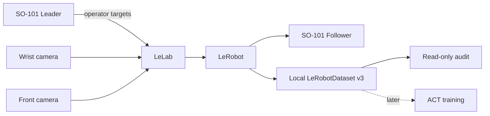

# PhysicalAI SO101 Lab

面向 Windows 的本地 SO-ARM101 学习与实验工作台。项目复用 Hugging Face 的
[LeLab](https://github.com/huggingface/leLab) 图形界面与
[LeRobot](https://github.com/huggingface/lerobot) 设备、数据集和训练能力，为一套
leader/follower SO-101 与 wrist/front 双相机建立可重复、可审计的工作流。

> 当前状态：7 个真实双视角回合已完成只读技术审计和官方 CPU loader 读回；真实 resume
> 采集路径尚未现场执行，ACT 训练尚未开始。
> 这不是 Hugging Face 官方仓库，也不是工业安全控制系统。

## 项目解决什么问题

从一套已经装好的 SO-101 台架出发，本项目把容易混在一起的步骤拆成清晰路径：

```text
固定依赖 → 启动 LeLab → 识别设备 → 校准与遥操作
         → 录制双视角回合 → 只读审计 → ACT 训练 → 有分母的真机评估
```

核心原则：

- **上游优先**：不重写机器人 UI、串口驱动、相机驱动、Dataset 格式或训练器。
- **本地优先**：服务只监听 loopback；数据、视频、校准、日志和模型默认不上传。
- **证据分层**：软件测试、相机观察、真机运动和任务成功分别验收，不互相替代。
- **可重建**：Python、LeLab、LeRobot 和必要补丁均固定到明确版本。
- **一次只做一件危险的事**：Browse 是只读；Replay、Record、Teleoperate 和 Inference 都可能驱动机械臂。

## 已实现能力

| 能力 | 当前结果 |
|---|---|
| 官方 LeLab 本地工作台 | 可启动、查看状态、记录日志并由项目脚本停止 |
| LeRobot SO-101 支持 | 使用固定 LeRobot v0.6.0，不创建同名替代包 |
| Leader / Follower | 已完成受监督校准和遥操作验证 |
| Wrist / Front 双相机 | 角色已确认；相机读取与句柄释放已验证 |
| 录制控制 | Accept、Timeout、Discard、Stop 具有独立语义 |
| Dataset v3 | 7 个真实双视角回合已 finalize、只读审计并由官方 CPU loader/PyAV 读回 |
| 数据浏览与审计 | 只读检查 Parquet、视频、回合边界、动作与时序 |
| 回合编号 | UI 显示人类序号 1–N，同时保留 Dataset 的零基 `episode_index` |
| 训练设备 | 默认 `Auto`，按当前 PyTorch 能力选择 CUDA、MPS、XPU 或 CPU |
| ACT 训练 / 真机策略评估 | 尚未开始 |

详细、非历史堆叠的当前状态见 [Project Status](docs/PROJECT_STATUS.md)。

## 硬件拓扑



本机保存的相机键保持兼容：

- `arm`：wrist camera
- `table_veiw`：front camera（保留现有拼写，不能在同一数据集中静默改名）

端口、USB instance ID、校准路径和家庭画面属于本地状态，不写入仓库。完整硬件流程见
[Hardware Setup](docs/HARDWARE.md)。

## 快速开始

### 1. 前置条件

- Windows 11 与 PowerShell
- Git
- [uv](https://docs.astral.sh/uv/) 0.12.4 或兼容版本
- Python 3.12（项目锁定环境当前解析为 3.12.13）
- Node.js/npm 仅在首次构建或重建 LeLab 前端时需要

### 2. 获取并构建固定上游

```powershell
git clone https://github.com/sgyliu8/LeRobot.git PhysicalAI-SO101-Lab
Set-Location .\PhysicalAI-SO101-Lab

powershell -NoProfile -ExecutionPolicy Bypass -File .\tools\bootstrap_upstream.ps1
uv sync --frozen
```

这一步会取得固定的 LeLab checkout、应用仓库内补丁并准备打包前端。它不是日常启动命令。

### 3. 启动工作台

```powershell
powershell -NoProfile -ExecutionPolicy Bypass -File .\scripts\lab.ps1 start
powershell -NoProfile -ExecutionPolicy Bypass -File .\scripts\lab.ps1 status
```

打开 [http://127.0.0.1:8000/](http://127.0.0.1:8000/)。日常启动不会升级依赖、下载模型、重新校准或自动连接机器人。

训练页默认使用 `Auto`。当前环境检测到 CPU 时会使用 CPU；迁移到已安装兼容加速版 PyTorch 的
GPU 电脑后会在任务启动时自动选择可用后端。若操作系统看见 NVIDIA GPU、但 PyTorch 不能使用
CUDA，页面会明确提示环境不匹配，不会假装已经启用 GPU。

```powershell
# 查看最新日志
powershell -NoProfile -ExecutionPolicy Bypass -File .\scripts\lab.ps1 logs

# 仅在没有活动硬件任务时停止项目拥有的服务
powershell -NoProfile -ExecutionPolicy Bypass -File .\scripts\lab.ps1 stop
```

更完整的安装、重建和故障恢复说明见 [Getting Started](docs/GETTING_STARTED.md)。

## 推荐使用顺序

1. 启动 UI，确认服务状态为空闲。
2. 在操作系统与实物之间确认 leader、follower、wrist、front 身份。
3. 检查已有校准；不要把重新 setup motors 当成普通启动步骤。
4. 在有人现场、机械臂固定和独立断电方式可用时进行有限遥操作。
5. 冻结任务、Dataset FPS、相机配置、编码设置和六关节限幅。
6. 新数据集先录 1 个短回合，finalize、浏览、审计并加载一个 CPU batch。
7. 使用第一次返回的精确 dataset ID 和同一 profile 再追加 2 个回合。
8. 三个真实回合全部通过后，才进入 ACT 训练准备。

录制与数据检查详见 [Data Workflow](docs/DATA_WORKFLOW.md)。

## 安全边界

- USB 已连接不等于舵机供电正确，也不等于机械臂可以运动。
- `Robot.connect()`、Calibrate、Teleoperate、Record、Replay 和 Inference 可能产生设备写入或运动。
- 页面中的 Stop 是软件任务停止，不是经过认证的 emergency stop，也不保证 torque off。
- 超时不代表动作没有执行；不要盲目重发运动请求。
- 真实运动必须有人在场，并有不依赖浏览器或键盘焦点的独立停止/断电方式。
- `max_relative_target` 只限制相邻位置目标差，不是速度、碰撞或力安全保证。

开始硬件操作前请完整阅读 [Safety](docs/SAFETY.md)。

## 验证

```powershell
# 公共文档、链接和配置示例
uv run --frozen python -X utf8 tools\validate_docs.py

# 项目回归（全部使用 fixture；不会连接机器人）
uv run --frozen --with pytest -- python -X utf8 -m pytest -q tests

# 固定 LeLab 后端
uv run --frozen --with pytest -- python -X utf8 -m pytest -q _vendor\lelab\tests

# 固定 LeLab 前端
Set-Location .\_vendor\lelab\frontend
npm test
npm run lint
npm run build
npm audit
```

绿色测试只证明对应软件范围。测试模式、HTTP 200 或页面可打开都不是硬件在线、运动安全或真实数据质量证明。

## 仓库结构

```text
.
├── README.md                 用户入口
├── docs/                     安装、硬件、数据、安全与开发文档
├── configs/                  非敏感示例与固定上游身份
├── schemas/                  项目配置和实验 sidecar schema
├── scripts/lab.ps1           start / status / logs / stop
├── tools/                    上游重建与只读数据审计
├── patches/                  固定 LeLab 的可重建补丁
├── tests/                    无硬件回归
├── templates/                实验与评估记录模板
├── pyproject.toml
└── uv.lock
```

`.venv/`、`_vendor/`、`.local/`、数据集、视频、校准、日志和模型均为本地生成内容，不进入 Git。

## 文档导航

| 文档 | 适合什么时候读 |
|---|---|
| [Getting Started](docs/GETTING_STARTED.md) | 第一次安装、重建或启动失败 |
| [Hardware Setup](docs/HARDWARE.md) | 连接、识别、校准、遥操作前 |
| [Data Workflow](docs/DATA_WORKFLOW.md) | 录制、续录、浏览、审计和训练准备 |
| [Data Contracts](docs/DATA_CONTRACTS.md) | Dataset、action、时间与 sidecar 的稳定语义 |
| [Safety](docs/SAFETY.md) | 任何相机隐私或机械运动前 |
| [Architecture](docs/ARCHITECTURE.md) | 理解 LeLab、LeRobot、补丁和本地数据边界 |
| [Development](docs/DEVELOPMENT.md) | 修改代码、补丁或运行测试 |
| [Troubleshooting](docs/TROUBLESHOOTING.md) | 端口、相机、UI、数据或停止问题 |
| [Project Status](docs/PROJECT_STATUS.md) | 当前完成项、限制和下一验收门槛 |

## 上游与许可

本项目依赖 LeLab 与 LeRobot，并保留其上游许可和归属。固定版本见
[`configs/upstream-pins.json`](configs/upstream-pins.json)。本仓库尚未为原创部分声明统一许可证；在许可证明确前，不应推断可自由再分发。原始家庭视频、数据集、校准和设备标识不属于代码公开范围。
