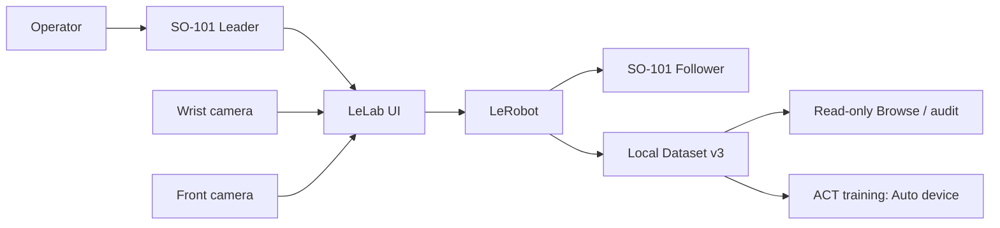

# PhysicalAI SO101 Lab

面向 Windows 的本地 SO-ARM101 实验工作台。它复用 Hugging Face 的
[LeLab](https://github.com/huggingface/leLab) 图形界面和
[LeRobot](https://github.com/huggingface/lerobot) 机器人、Dataset 与训练能力，把设备确认、
双相机录制、只读审计和 ACT 训练串成一条可重复的路径。

> 当前已验证：leader/follower 有限遥操作、wrist/front 双相机、7 个真实双视角回合、
> 官方 Dataset loader/CPU DataLoader 读回、ACT checkpoint 完整状态续训与再次加载，以及一个真实
> 回合驱动的 MuJoCo 运动学回放。三色分拣 C0 软件链已提供，但真实 pilot、离线策略和真机分拣
> 仍未验证。完整基线训练与策略真机评估仍未完成。

本项目不是 Hugging Face 官方仓库，也不是工业安全控制系统。

## 导航

- [适合谁](#适合谁)
- [项目能力](#项目能力)
- [快速开始](#快速开始)
- [新用户完整流程](#新用户完整流程)
- [CPU 与 GPU 训练](#cpu-与-gpu-训练)
- [三色方块分拣](#三色方块分拣)
- [数据与安全边界](#数据与安全边界)
- [项目贡献](#项目贡献)
- [开发与验证](#开发与验证)
- [文档地图](#文档地图)

## 适合谁

这个仓库适合拥有以下台架、希望用官方软件链完成本地学习和实验的用户：

- 一只 SO-101 leader 和一只 SO-101 follower；
- 一台腕部或夹爪附近相机；
- 一台桌面前视相机；
- 一台 Windows 电脑，可只有 CPU，也可带受 PyTorch 支持的 GPU。

它不会替你判断供电、固定、碰撞空间或紧急停止是否安全，也不会在日常启动时自动校准、
下载模型、上传数据或驱动机械臂。

## 项目能力

| 能力 | 当前状态 |
|---|---|
| LeLab 本地 UI | 可 start、status、logs、stop；仅使用 loopback |
| LeRobot SO-101 | 固定 LeRobot v0.6.0，不维护替代驱动 |
| Leader / follower | 已完成一次受监督校准和有限遥操作验证 |
| Wrist / front 相机 | 已按真实画面确认角色与句柄交接 |
| 录制控制 | Accept、Timeout、Discard、Stop 语义分离 |
| Dataset v3 | 7 个真实回合已 finalize、只读审计并由官方 loader 读回 |
| Episode 显示 | UI 使用人类序号 1–N，同时显示零基 Dataset index 0–N-1 |
| 训练设备 | `Auto` 在任务启动时选择 CUDA、MPS、XPU 或 CPU |
| 视频解码 | 本地训练固定使用 PyAV，并在创建任务前解码真实样本 |
| ACT | CPU checkpoint 已从 step 1000 续训到 1002、保存并完整重载；完整基线与真机评估未运行 |
| 三色分拣 | C0 配置、只读颜色观察、人工标签、session split、ACT 32/8 参数链与结果卡可用；C1–C4 未运行 |
| MuJoCo 学习实验 | 固定 SO101 模型的真实回合 headless 与原生 viewer 运动学回放已通过 |
| ROS 2 / 视觉几何 | 离线输入和审计链已准备；本机 ROS 运行与相机几何标定尚未执行 |

完整验收边界见 [Project Status](docs/PROJECT_STATUS.md)。

## 系统组成



现有真实数据继续保留以下相机键：

- `arm`：wrist camera；
- `table_veiw`：front camera。

`table_veiw` 的拼写是已录数据合同的一部分，不能在同一个 Dataset 中静默改名。

## 快速开始

### 第一次安装

前置条件：Windows 11、PowerShell、Git、[uv](https://docs.astral.sh/uv/) 和 Node.js 22.13+ / npm
（建议 Node 24 LTS）。
项目要求 Python 3.12；`uv` 会按锁文件准备独立环境。

```powershell
git clone https://github.com/sgyliu8/LeRobot.git PhysicalAI-SO101-Lab
Set-Location .\PhysicalAI-SO101-Lab

.\Start-SO101-Lab.cmd setup
```

Setup 取得固定上游、应用仓库补丁、构建前端并安装本目录独立环境。需要网络，首次耗时取决于下载。
安装后运行 `Start-SO101-Lab.cmd check` 核对实际导入与 CPU/GPU 能力；
已验证范围见 [Project Status](docs/PROJECT_STATUS.md)。

### 日常打开

在仓库根目录双击 **`Start-SO101-Lab.cmd`**。同一个菜单提供打开、安装/重建、更新、环境检查、
状态、日志和停止；它随仓库更新，不需要重新制作快捷方式。按 Enter 打开工作台。
打开操作先验证锁文件、补丁与实际导入身份，再启动并打开
[http://127.0.0.1:8000/](http://127.0.0.1:8000/)，不安装依赖或连接硬件。

也可以在 PowerShell 中运行：

```powershell
.\Start-SO101-Lab.cmd
# 不经过菜单
.\Start-SO101-Lab.cmd open
.\Start-SO101-Lab.cmd check
.\Start-SO101-Lab.cmd update
```

### 查看与停止

```powershell
# 当前状态
powershell -NoProfile -ExecutionPolicy Bypass -File .\scripts\lab.ps1 status

# 最新日志
powershell -NoProfile -ExecutionPolicy Bypass -File .\scripts\lab.ps1 logs

# 仅在没有活动硬件任务时停止本项目服务
powershell -NoProfile -ExecutionPolicy Bypass -File .\scripts\lab.ps1 stop
```

启动脚本只管理自己记录且身份匹配的进程；不会因为端口 8000 被占用就终止其他程序。

## 新用户完整流程

### 1. 安装并确认软件

完成上面的首次安装后，先运行状态命令并打开 UI。此时“页面可打开”只证明软件服务可用，
不证明机械臂或相机已正确连接。

### 2. 识别设备

在操作系统和实物之间逐一确认：

- 哪个串口属于 leader，哪个属于 follower；
- 哪个画面属于 wrist，哪个属于 front；
- 相机实际支持的分辨率和捕获率；
- 已有校准是否与当前这套硬件匹配。

不要把普通 `COM1`、猜测的 camera index 或“USB 已插入”当作身份确认。详细步骤见
[Hardware Setup](docs/HARDWARE.md)。

### 3. 有人现场完成运动检查

只有在机械臂固定、供电正确、工作区清空、操作者在场，并且有独立断电或停止方式时，才进入
Calibrate、Teleoperate、Record、Replay 或 Inference。已有有效校准时不要为测试而强制重标定。

### 4. 冻结录制配置

创建正式 Dataset 前固定以下内容：

- Dataset ID 与任务文字；
- Dataset FPS；
- `arm` / `table_veiw` 相机角色、分辨率和请求帧率；
- H.264/PyAV 编码设置；
- 六关节顺序、单位和 `max_relative_target`；
- `push_to_hub=false`。

推荐从 640×480、Dataset 15 Hz 开始实测。`max_relative_target` 只是相邻位置目标差约束，
不是速度、碰撞、力或功能安全保证。

### 5. 先录一个短回合

新 Dataset 先录 1 个短回合并正常结束。随后在 Browse 中确认：

- Episode 1 对应 Dataset index 0；
- 两路视频都属于正确相机；
- Parquet 帧数、视频窗口和回合边界一致；
- action/state 是有限六维向量；
- Browse 没有 repair、删除或改写原始数据。

### 6. 只读审计与 loader 读回

```powershell
uv run --frozen python -X utf8 .\tools\audit_dataset.py <owner/dataset-id> `
  --camera arm --camera table_veiw
```

审计 `PASS` 只表示技术合同通过，不表示任务动作成功。任务成功、失败或中止仍需要操作者逐回合判断。

### 7. 需要时续录

使用第一次录制返回的精确 Dataset ID 和完全相同的 profile 进行 resume。不要手工拼接文件，
也不要在同一个 Dataset 中更改 FPS、相机键、关节单位或标签语义。

### 8. 开始训练

进入 Training，选择本地 Dataset、ACT 和 `Auto` 设备。保持 PyAV 视频后端；系统会在任务记录和
训练进程创建前，用官方 Dataset loader 解码真实样本。任务记录同时保存请求设备与实际解析设备。

checkpoint 下拉框分别显示 model 与完整恢复文件的静态健康状态。Resume 会创建一个有明确父任务、
源 step 和目标 global step 的新任务；创建成功只表示“恢复任务已启动”，必须看到模型、优化器、
随机状态和数据顺序加载成功，随后保存并再次加载，才可称完整恢复成功。训练步骤详见
[Data Workflow](docs/DATA_WORKFLOW.md)。

## CPU 与 GPU 训练

同一份仓库可以在不同电脑上使用：

- **只有 CPU**：`Auto` 选择 CPU，适合 loader、1-step smoke 和小规模调试；完整 ACT 训练会较慢。
- **NVIDIA GPU**：只有当前 PyTorch 构建实际报告 CUDA 可用时，`Auto` 才选择 CUDA。
- **其他后端**：受支持时依次考虑 MPS 或 XPU；否则回退 CPU。
- **环境不匹配**：操作系统看见 NVIDIA GPU、但 PyTorch 不能用 CUDA 时，UI 会显示明确提示，
  不会假装正在使用 GPU。

从 GitHub clone 到新 GPU 电脑后仍按“第一次安装”重建锁定环境，不要复制旧电脑的 `.venv/`、
可执行缓存。真实数据和同一套机械臂的校准要单独备份、核对后恢复，详见
[迁移电脑](docs/GETTING_STARTED.md#迁移到另一台电脑)。锁定项目不会凭操作系统中的显卡自动替换 PyTorch 构建；先确认项目环境内
`torch.cuda.is_available()` 为真，再运行一个有界 smoke。每个训练任务以其记录的
`requested_device` / `resolved_device` 为准。Windows 锁文件当前可解析为 CPU PyTorch；如果在
GPU 主机按 PyTorch 官方方式安装兼容 CUDA build，之后再次执行 `uv sync --frozen` 可能恢复锁定
版本，因此每次同步后都要重新查询 CUDA 状态。自动识别负责选择当前环境已经具备的后端，不负责
静默安装显卡运行时。

## 三色方块分拣

LeLab 的 Record 对话框包含 `color_sorting_v1` pilot 预设，Training 中 ACT 分别配置预测块长度与执行
前缀。实际颜色、cube/bin 尺寸、ROI 和 Dataset ID 不在公开示例中猜测；先建立被 Git 忽略的本地
profile，再用保存帧标定只读观察器。

人工标签保留 success、failure、abort、unknown 和 preflight rejected 的完整分母，并按 session
冻结 train/validation/test。Browse 只显示经过身份检查的本地摘要；没有摘要时不会把 episode 数量
当作任务成功。完整流程见 [Three-Color Sorting](docs/TASK_COLOR_SORTING.md)，policy 输入与 32/8
候选参数见 [Policy Guide](docs/POLICIES.md)。

## 数据与安全边界

- Dataset、视频、Parquet、校准、设备标识、日志、截图和模型都保存在本地并被 Git 忽略。
- 正常录制固定 `push_to_hub=false`；上传、云训练和 W&B 都是独立的显式操作。
- Browse 和审计是只读路径；Replay 会驱动机械臂，两者不能混淆。
- Stop 是软件任务停止，不是经过认证的 emergency stop，也不保证 torque off。
- 超时后不要盲目重发运动请求；先观察设备和任务状态。
- 家庭画面可能包含人员、屏幕或私人物品，预览和提交前应主动检查。

任何运动前请完整阅读 [Safety](docs/SAFETY.md)。

## 项目贡献

项目发起者与实验操作者 [@sgyliu8](https://github.com/sgyliu8) 的主要贡献包括：

- 定义 SO101 Lab 的本地优先目标、数据合同、阶段验收和安全边界；
- 搭建并操作 SO-101 leader/follower 与 wrist/front 双相机实验台；
- 完成一次受监督校准、有限遥操作和相机角色确认；
- 采集 7 个真实双视角回合，并推动 Episode 1–N 与零基 Dataset index 的清晰区分；
- 复现 Windows 训练解码与 CPU 环境问题，推动自动设备检测、PyAV preflight 和错误提示；
- 以真实数据读回、只读审计和有界训练 smoke 作为验收依据，而不是只看页面或 HTTP 状态。

软件能力建立在 LeLab 与 LeRobot 上；上游作者仍拥有各自项目的设计、实现和许可归属。

## 开发与验证

```powershell
# 锁文件和真实导入来源
uv lock --check
uv run --frozen python -X utf8 -c "import lelab, lerobot; print(lelab.__file__); print(lerobot.__file__)"

# 公共文档、链接、配置示例和公开文件边界
uv run --frozen python -X utf8 .\tools\validate_docs.py

# 项目无硬件回归
uv run --frozen --group test python -X utf8 -m pytest -q tests

# 固定 LeLab 后端
uv run --frozen --group test python -X utf8 -m pytest -q _vendor\lelab\tests

# 固定 LeLab 前端
Set-Location .\_vendor\lelab\frontend
npm test
npm run lint
npm run build
```

绿色测试只证明对应软件范围。fixture、HTTP 200、页面可打开或 `test_mode` 都不能代替真机证据。
修改补丁和运行 fresh-apply gate 的规则见 [Development](docs/DEVELOPMENT.md)。

## 仓库结构

```text
.
├── Start-SO101-Lab.cmd       双击启动入口
├── README.md                 用户入口
├── docs/                     安装、硬件、数据、安全、状态与开发说明
├── configs/                  非敏感示例与固定上游身份
├── so101_lab/                三色任务配置、观察、标签与分区工具
├── schemas/                  配置和实验 sidecar schema
├── scripts/workbench.ps1     安装、更新、检查与快速入口菜单
├── scripts/lab.ps1           受控 start / status / logs / stop
├── tools/                    上游重建、文档校验与只读数据审计
├── patches/                  固定 LeLab 的可重建补丁
├── tests/                    无硬件回归
├── examples/mujoco/          隔离的真实回合运动学回放
├── integrations/ros2/        只读 JointState / TF / RViz / bag 准备
├── experiments/              尚未执行的测量实验合同
├── templates/                实验与评估记录模板
├── pyproject.toml
└── uv.lock
```

`.venv/`、`_vendor/`、`.local/`、数据集、视频、校准、日志和模型不会进入 Git。

## 文档地图

| 文档 | 使用时机 |
|---|---|
| [Getting Started](docs/GETTING_STARTED.md) | 首次安装、重建、启动和迁移电脑 |
| [Hardware Setup](docs/HARDWARE.md) | 识别设备、校准或遥操作前 |
| [Data Workflow](docs/DATA_WORKFLOW.md) | 录制、续录、浏览、审计和训练 |
| [Data Contracts](docs/DATA_CONTRACTS.md) | Dataset、action、时序和 sidecar 语义 |
| [Three-Color Sorting](docs/TASK_COLOR_SORTING.md) | 配置 C0、采集 C1、人工标签、分区与结果查看 |
| [Policy Guide](docs/POLICIES.md) | ACT 输入、chunk/执行前缀、设备选择与离线验收 |
| [Safety](docs/SAFETY.md) | 相机隐私或任何机械运动前 |
| [Architecture](docs/ARCHITECTURE.md) | 理解上游、补丁和本地数据边界 |
| [Troubleshooting](docs/TROUBLESHOOTING.md) | 端口、相机、数据、训练或停止失败 |
| [Project Status](docs/PROJECT_STATUS.md) | 当前完成项、限制和下一门槛 |
| [Development](docs/DEVELOPMENT.md) | 修改代码、补丁或运行完整 gate |
| [MuJoCo playback](examples/mujoco/README.md) | 用本地真实回合驱动固定 SO101 模型 |
| [ROS 2 playback](integrations/ros2/README.md) | 准备只读 JointState → TF → RViz → rosbag2 |
| [Vision geometry](experiments/vision_geometry/README.md) | 准备固定 front 相机与 ChArUco 几何实验 |

## 上游与许可

固定上游身份见 [`configs/upstream-pins.json`](configs/upstream-pins.json)。本项目依赖 LeLab 和
LeRobot，并保留其上游许可与归属。本仓库尚未为原创部分声明统一许可证；在许可证明确前，
不应推断可自由再分发。真实家庭视频、Dataset、校准和设备标识不属于代码公开范围。
