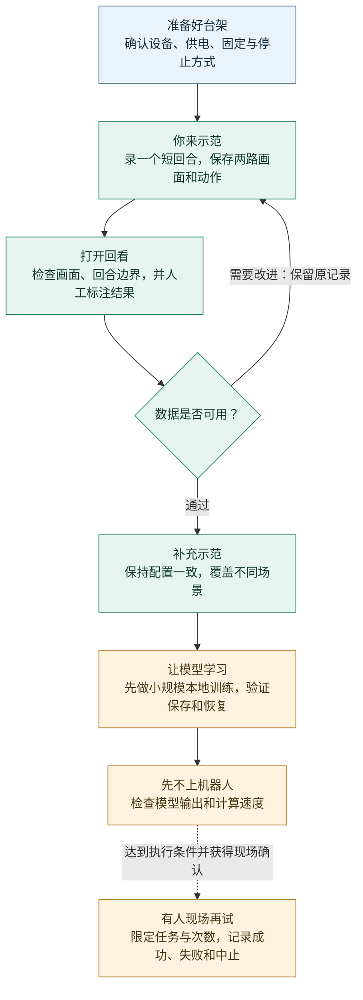

# PhysicalAI SO101 Lab

**把桌面上的机械臂，变成一个能示范、能记录、能学习的实验台。**


你握着一只机械臂，示范怎样拿起方块、放进盒子；另一只机械臂跟着做。
两台相机分别记录“手边发生了什么”和“桌面上发生了什么”。
SO101 Lab 帮你把这些示范保存下来、逐回合检查，再交给模型学习。

这是一套 **Windows 本地工作台**，复用 [LeLab](https://github.com/huggingface/leLab) 的操作界面和
[LeRobot](https://github.com/huggingface/lerobot) 的机器人与训练能力。
不需要先搭建云服务，也不需要先学 ROS。只有 CPU，也可以从数据记录和检查开始。

[开始使用](#快速开始) · [认识实验台](#一张桌子上的学习实验室) · [操作流程](#从一次示范到一次验证) · [当前进展](#现在走到了哪一步) · [使用指南](#按你现在要做的事找文档)

> **先说清楚边界：**真实双相机录制、数据读回和训练断点恢复已有验证；
> 模型自主完成抓放、三色分拣的真机效果尚未验证。这不是一套开箱即会分拣的机器人。

## 一张桌子上的学习实验室

| 组成 | 它做什么 | 在软件里叫什么 |
|---|---|---|
| 你手上的示教臂 | 由你带着运动，提供操作示范 | Leader |
| 桌面上的执行臂 | 在受监督的遥操作中跟随，完成实际抓放 | Follower |
| 靠近夹爪的相机 | 看清接近、夹取和放下的细节 | Wrist，相机键 `arm` |
| 桌面支架上的相机 | 看清方块、盒子和机械臂的位置关系 | Front，相机键 `table_veiw` |
| 你的电脑 | 打开工作台，保存、检查数据并运行训练 | LeLab + LeRobot |

这里是“一只臂示范、一只臂执行”，不是两只执行臂协作。上图是角色示意，不是实物照片或尺寸图。
`table_veiw` 的拼写沿用已有数据，不能在同一数据集中随意改名。

## 快速开始

### 1 · 第一次，把软件装好

准备 Windows 11、PowerShell、[Git](https://git-scm.com/downloads)、[uv](https://docs.astral.sh/uv/getting-started/installation/)
和 [Node.js](https://nodejs.org/en/download)（22.13+，已验证 Node 24）。Python 3.12 由 uv 为本项目准备。
首次安装需要网络。

在 PowerShell 中依次运行：

```powershell
git clone https://github.com/sgyliu8/LeRobot.git PhysicalAI-SO101-Lab
Set-Location .\PhysicalAI-SO101-Lab
.\Start-SO101-Lab.cmd setup
.\Start-SO101-Lab.cmd check
.\Start-SO101-Lab.cmd open
```

安装会准备固定版本的依赖和界面，不会自动校准或驱动机械臂。
打开后，在浏览器访问 **[本地工作台 · 127.0.0.1:8000](http://127.0.0.1:8000/)**。
页面能打开，只代表软件已启动，不代表设备已经确认。

### 2 · 以后，双击一个文件

在项目文件夹里双击 **[`Start-SO101-Lab.cmd`](Start-SO101-Lab.cmd)**，按 Enter 即可打开工作台。
可以给它创建桌面快捷方式；这个入口随仓库持续更新，不用每次换版本都重新制作。

| 你想做什么 | 菜单 / PowerShell 命令 |
|---|---|
| 打开工作台 | Enter，或 `.\Start-SO101-Lab.cmd open` |
| 检查环境和 CPU / GPU | `.\Start-SO101-Lab.cmd check` |
| 查看状态或日志 | `.\Start-SO101-Lab.cmd status` / `logs` |
| 停止本项目服务 | `.\Start-SO101-Lab.cmd stop` |
| 获取更新并重建环境 | `.\Start-SO101-Lab.cmd update` |

日常打开不会升级依赖、下载模型或启动机械运动。
**更新前，先在界面正常结束任务，再停止服务。**端口被别的程序占用时，不会强行关闭它。

安装失败、重建环境、迁移电脑的详细步骤都在 [安装与日常使用](docs/GETTING_STARTED.md)。

## 从一次示范到一次验证

不要急着录几百遍。先走通一个短回合，再扩大数据量。



**录制时：**你负责移动示教臂。创建数据集前，先固定相机名称、分辨率、帧率和关节单位；
可以从 640×480、数据集 15 Hz 候选开始实测，实际相机能力另行确认。
已有有效校准时，不必为了“重新开始”而强制重标定。

**回看时：**在 Browse 中检查两路视频。一次完整尝试叫一个“回合”（Episode）。
例如第七个回合显示为 **`Episode 7 of 7 · dataset index 6`**：前面是人的计数，后面是从 0 开始的数据编号，
并不是少录了一次。技术检查通过，也不等于抓放成功，结果仍需逐回合判断。

**追加时：**使用首次返回的同一个数据集 ID 和相同配置续录，不手工拼文件。
失败、中止与成功都要保留记录；不要只挑好看的视频。

**训练时：**从 ACT 开始——它根据画面和机械臂状态学习一小段连续动作。
先确认数据能读、训练能保存、保存后能恢复，再讨论更长训练。
“模型训练完了”与“机器人会做了”是两件事。

完整操作步骤与只读检查命令见 [录制、回看与训练](docs/DATA_WORKFLOW.md)。

## 现在走到了哪一步

下面区分的是**已有证据**与**下一步实验**，不是用开发版本号表示完成度。

| 已有验证 | 还不能据此推断 |
|---|---|
| 主从校准、有限遥操作和两路相机角色确认 | 任意姿态、长期运行都安全 |
| 7 个真实双视角回合，已重新打开并由官方数据工具读回 | 7 个回合都完成了任务，或真实续录流程已经验收 |
| CPU 训练从第 1000 步恢复到 1002，再保存、再加载 | 一个完整模型已经训练好，或可以直接上机器人 |
| 三色任务的配置、标签、数据分组和训练参数链已实现 | 已采集三色示范，或已经实现自主分拣 |
| 真实回合驱动模拟机械臂姿态回放 | 动力学、碰撞和真机任务效果已经验证 |

当前完整训练基线、三色任务训练和真机评估仍未完成。
更细的验证范围与限制见 [项目状态](docs/PROJECT_STATUS.md)。

## 下一站：三色方块分拣

目标很直观：**把方块放进同色盒子**。但先从一个方块开始，不把“会做一道题”当成“会整理整张桌子”。

| 顺序 | 场景怎样变化 | 重点看什么 |
|---|---|---|
| ① 一个方块 | 随机一种颜色，三个盒子位置固定 | 能否拿起并放进正确盒子 |
| ② 少量方块 | 方块彼此分开，选择顺序明确 | 能否稳定选择下一个目标 |
| ③ 多个方块 | 一次完成有限数量的整理 | 整场结果，以及失败后发生了什么 |
| ④ 盒子换位 | 改变盒子位置 | 学到的是颜色匹配，还是固定位置 |

工作台已提供 `color_sorting_v1` 任务预设；**以上四个实物阶段都尚未验证**。
实际颜色、尺寸与布局由现场配置决定。旧抓放数据不能冒充新任务的分拣示范。

颜色观察工具可以帮助检查保存画面，看不清时返回“未知”；它不会因为方块消失就自动判成功，
也不会把普通 ACT 变成能理解任意文字指令的模型。

从这里开始：[三色分拣操作指南](docs/TASK_COLOR_SORTING.md) · [ACT 怎么学、参数怎么选](docs/POLICIES.md)。

## 只有 CPU 可以用吗？换电脑怎么办？

**可以从当前电脑开始。**CPU 足够用于软件操作、数据读回与小规模训练检查，
长时间训练会慢；现场录制还要实测双相机吞吐，不能只看页面是否流畅。

训练设备默认选择 **Auto**。它使用当前环境真正可用的加速设备；没有可用 GPU，就使用 CPU。
“电脑装了显卡”不等于“训练正在使用显卡”，以环境检查和任务显示的实际设备为准。

换电脑时，分开搬这两部分：

| 从 GitHub 获取 | 通过自己的私有备份迁移 |
|---|---|
| 代码、启动入口、固定依赖和使用文档 | 数据集、模型、任务记录、本地配置和本套硬件的校准 |
| 在新电脑运行 Setup → Check | 先确认文件完整，再回看、读回和验证恢复 |

不要复制旧 `.venv` 或旧进程记录。GPU 电脑需要兼容的 PyTorch 构建；自动检测不会替你静默安装显卡运行时。
Setup / Update 后也要重新 Check，因为锁定安装可能恢复 CPU 构建。
另一台实体电脑和 GPU 上的实际运行仍需现场验收，不能承诺任何主机直接可用。

按 [换电脑迁移清单](docs/GETTING_STARTED.md#迁移到另一台电脑) 逐项操作即可。

## 开始运动前，记住这几件事

- **页面不是安全证明。**USB 连上、画面亮了，不代表电源、固定和运动空间都正确。
- **先准备独立停止方式。**软件 Stop 不等于物理断电，也不是经过认证的急停。
- **回看视频不会移动机器人。**真正的动作重放或模型控制需要单独的现场确认；不要混为一谈。
- **保留本地原件。**视频、数据集、校准、日志和模型不进入本仓库；默认关闭录制上传，云训练和上传需另外决定。

任何机械运动前，完整阅读 [硬件确认](docs/HARDWARE.md) 与 [安全说明](docs/SAFETY.md)。
本项目用于受监督的学习实验，不是工业安全控制系统。

## 谁在把它做成可用的实验台

项目由 **[@sgyliu8](https://github.com/sgyliu8)** 发起并进行实物实验：

- 搭建主从机械臂与双相机台架，完成校准、遥操作和真实示范采集；
- 从实际使用中提出问题：回合编号看不懂、CPU 训练报错、训练中断后怎样接着跑；
- 推动长期可用的快速入口、环境检查和迁移流程，让项目不只停在“代码能运行”；
- 用真实数据读回与恢复试验验证改进，并定义三色分拣的任务与验收边界。

**LeLab 提供操作界面，LeRobot 提供机器人与学习能力；本项目把它们接成一条适合本地 SO101 台架的使用路径。**
我们维护固定版本、必要修补、数据检查和操作文档，不另造一套驱动、数据格式或训练框架。

## 按你现在要做的事找文档

| 我想…… | 从这里读 |
|---|---|
| 安装、打开、更新或换电脑 | [安装与日常使用](docs/GETTING_STARTED.md) |
| 确认机械臂、相机与运动条件 | [硬件指南](docs/HARDWARE.md) · [安全说明](docs/SAFETY.md) |
| 录制、追加、回看、训练 | [数据操作流程](docs/DATA_WORKFLOW.md) · [数据字段与时间含义](docs/DATA_CONTRACTS.md) |
| 开始三色任务，理解模型选择 | [三色分拣](docs/TASK_COLOR_SORTING.md) · [策略指南](docs/POLICIES.md) |
| 解决错误，确认已经验证了什么 | [故障排查](docs/TROUBLESHOOTING.md) · [项目状态](docs/PROJECT_STATUS.md) |
| 修改代码、运行测试或重建补丁 | [架构](docs/ARCHITECTURE.md) · [开发指南](docs/DEVELOPMENT.md) |

<details>
<summary>进一步学习：模拟回放、ROS 2 与视觉几何</summary>

- [MuJoCo 回放](examples/mujoco/README.md)：已完成真实回合驱动的姿态回放，不等于动态分拣验证。
- [ROS 2 只读回放](integrations/ros2/README.md)：输入与操作说明已准备，实际 ROS 运行尚未执行。
- [视觉几何实验](experiments/vision_geometry/README.md)：准备测量与标定，等待实物尺寸和现场图像。

这些不是第一次安装或录制的前置条件。

</details>

## 上游与许可

感谢 [Hugging Face LeLab](https://github.com/huggingface/leLab) 与
[LeRobot](https://github.com/huggingface/lerobot) 的作者和社区。
准确依赖身份见 [固定版本配置](configs/upstream-pins.json)；上游代码保留各自许可和归属。

本项目不是 Hugging Face 官方仓库。原创部分尚未声明统一许可证，不应据此推断可自由再分发。
公开范围是代码、非敏感配置、文档与原创示意图，不包含真实家庭画面或私有实验数据。
