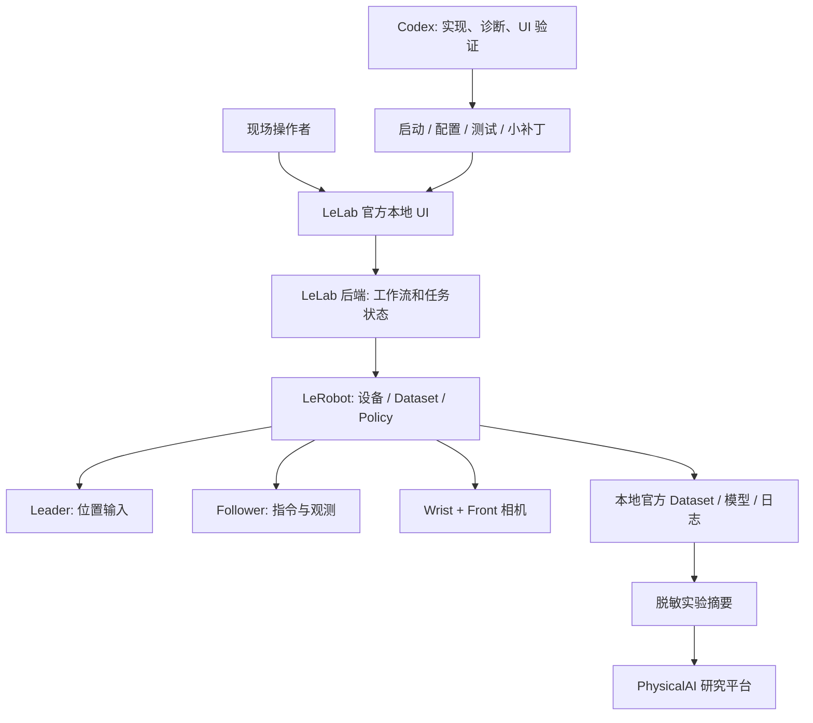

# Architecture — 复用优先的本地实验工作台

## 1. 决策摘要

保留 PhysicalAI 的研究职责；新子仓库承载配置、可重建启动、诊断、测试和必要补丁。
操作界面使用固定版本 LeLab；驱动、数据、策略、训练和推理使用其兼容 LeRobot。
先采用一个 LeLab 本地服务和其内置 UI。没有需求证据就不增加第二个 FastAPI 服务、消息总线或自建控制前端。

## 2. 系统结构



此图是设计，不是当前已经运行的拓扑。Codex 不在 servo 高频控制回路中，LLM 不逐步生成在线舵机命令。
公共 PhysicalAI 页面不向本地执行器发送命令；初期只通过本地链接打开 LeLab。

## 3. 根目录与文件职责

```text
Lerobot/                       独立 Git 根；不是上游 Python 包目录
├── README.md                  用户入口与导航
├── AGENTS.md                  简短、强制的执行合同
├── HANDOFF.md                 当前状态、阻塞和下一步
├── CHANGELOG.md               已交付历史
├── PACK_MANIFEST.json         本包文件清单，非运行证明
├── .gitignore / .gitattributes / .editorconfig
├── docs/
│   ├── REQUIREMENTS.md / ARCHITECTURE.md / ROADMAP.md
│   ├── UI_SPEC.md / DATA_CONTRACTS.md / TEST_PLAN.md
│   ├── CI_POLICY.md / SECURITY.md / DEPENDENCIES.md
│   ├── architecture/          接口与上游补丁决策
│   ├── operations/            按任务的操作和故障处理
│   ├── research/              来源登记与事实边界
│   ├── reviews/               三轮评审与静态验证报告
│   └── prompts/               启动和恢复提示词
├── configs/                   已审候选版本、非敏感配置示例
├── schemas/                   本项目 sidecar/config 合同
├── templates/                 单次实验、评估记录模板
├── tools/                     本包只有无硬件 validator
└── tests/                     本包 validator 的小型离线测试
```

M1 后按需要新增 `pyproject.toml`、`uv.lock`、`.python-version` 和启动脚本。
只有已有组件无法完成必要适配时才增加 `src/so101_lab/`。
不得为了让文件树显得完整而先创建空的 `drivers/`、`policies/`、`simulation/`、`services/`。
未来本地生成：`.venv/`、`.local/`、`_vendor/`、`data/`、`models/`、`outputs/`，全部忽略。

## 4. 仓库、包名与父项目隔离

两个 Git 仓库物理嵌套，但没有运行依赖继承或版本控制继承。
父项目 local exclude 忽略整个 `/Lerobot/`；它不能跟踪子目录或 gitlink。
子项目 remote 是 `sgyliu8/LeRobot`，上游代码来源是 `huggingface/leLab` / `huggingface/lerobot`，三者不可混淆。
项目 distribution 名预定 `physicalai-so101-lab`，内部 namespace `so101_lab`。不创建 `lerobot/__init__.py` 竞争官方包。
父环境、Node 依赖、研究构建与当前 PR 不受子项目安装影响。

## 5. 运行和数据目录

默认服务 `127.0.0.1:8000`，父研究门户此前使用 `127.0.0.1:4330`；启动前验证实际占用，不盲杀端口持有者。
使用 LeLab 已打包前端，不用开发服务器做日常台架操作。

虚拟环境不隔离 upstream 的 user-home 状态。固定 LeLab 源码中校准目录是：
`~/.cache/huggingface/lerobot/calibration/teleoperators/so_leader/`
与 `.../robots/so_follower/`，不是可直接从旧文档推导的 so101_* 目录。
代码也在同一用户缓存树存储端口及 robot records；不要默认 HF_HOME 会改写这些硬编码路径。
M1 必须输出实际路径映射，采用特定设备 ID，只备份和修改属于本项目的条目。首次不为隔离而重写整个缓存系统。

Dataset 和模型的实际根目录由固定版本可用配置确定；`configs/lab.example.json` 的路径只是本项目意图，不会自动改变 LeLab 行为。
如果 UI 无法配置存储位置，先使用受控 upstream 路径并纳入备份/磁盘预算；确有容量需求时再做小范围路径适配。

## 6. 模式与所有权

抽象状态：`OFFLINE → UI_IDLE → CAMERA_PREVIEW → BENCH_READY → CALIBRATING/TELEOPERATING/RECORDING/REPLAYING/INFERENCING → STOPPING → UI_IDLE`，异常转 `FAULT`。
这是项目状态语义，不宣称与 upstream API enum 一一相同。

OS 枚举无需抢占设备；摄像头预览和正式记录必须交接捕获句柄。
记录模式自身执行遥操作，不是再并行开一个 teleoperate 进程。
通过已存在的 owner 进程读 telemetry；不要第二个程序打开串口“监测状态”。
同一套硬件的所有模式入口需互斥，含校准、重放与推理。上游局部 flag 检查不自动等于跨模块原子互斥；在 M1 用无硬件并发测试核对，缺口按小补丁策略处理。

## 7. 停止与可信状态

浏览器关闭、请求超时、进程退出、失能和切断供电语义不同。
退出请求必须先让当前设备 owner 正常停止并释放资源；不能为释放端口直接杀死仍掌握机械臂的进程。
停止后的实际扭矩/姿态要按连接实现与实物结果报告；失能可能导致下垂。禁止无证据“安全停止成功”。
若后台线程、状态读取或网络断开，UI 显示未知/故障及最后更新时间，绝不补零装作零位。

## 8. 本地 Web 边界

Loopback 是网络范围，不是完整授权机制。固定源码存在宽 CORS，且 WebSocket 接受连接；M1 检查 UI write endpoints、Host/Origin、重复启动和服务归属。
优先同源本地 UI。必要的最小 patch 对写入/WS 校验本地可信来源并拒绝不匹配来源，不做企业登录平台。
来自无 Origin 的本地 CLI 测试按显式本地测试路径控制；不把 CORS 本身当成鉴权。策略、token 或工具审批应按实际边界验证。
不要公开端口、建立公网隧道或让云端 Space 控制家庭机器人。

## 9. PhysicalAI 回接

M8 首先生成脱敏、只读实验摘要：任务、软件版本、dataset/model 身份、成功/失败分母、限制和关联论文。
原始视频和本地路径不进入父门户公共 build。
修改父门户链接是另外一次小范围变更，不借此升级父项目、重新跑其全部研究流水线或自动合并其 Draft PR。

Sources: [源码核查](research/SOURCE_AUDIT.md)、[边界 ADR](architecture/ADR-001-BOUNDARIES.md)、[补丁 ADR](architecture/ADR-002-PATCHES.md)。
