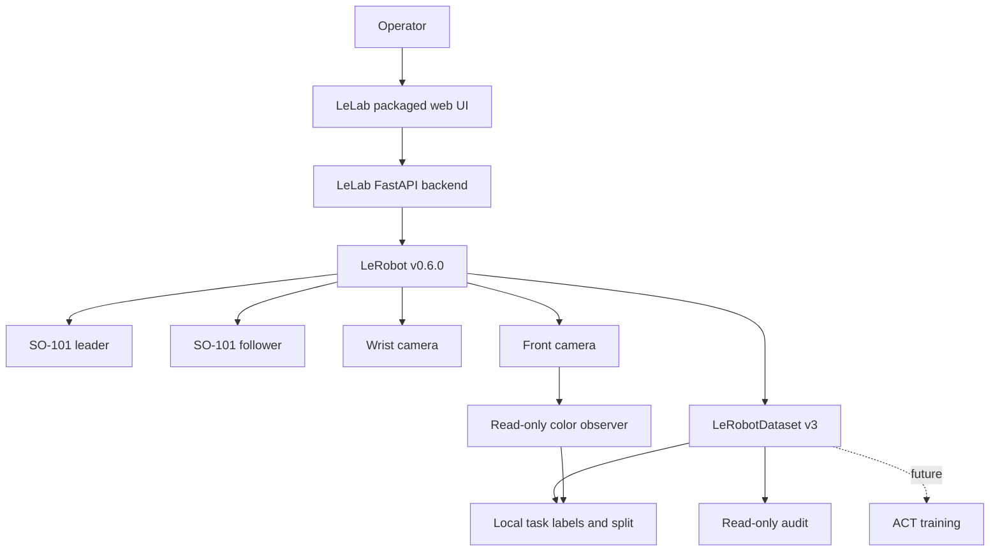

# Architecture

本项目是 LeLab 与 LeRobot 之上的本地集成层，不是新的机器人框架。

## 组件关系



LeLab 负责操作流程和页面，LeRobot 负责设备、数据、策略与训练。本仓库只负责：

- 固定依赖和上游源码身份；
- 构建并启动本地工作台；
- 对已经复现的关键缺口应用小型补丁；
- 提供无硬件回归、只读审计和操作文档；
- 保存非敏感配置示例与实验 sidecar schema。

## 运行边界

### 本地服务

`scripts/lab.ps1` 管理一个绑定到 `127.0.0.1` 的 LeLab 服务。脚本记录并复核进程身份，不根据端口号盲目终止其他应用。停止前会检查当前硬件模式；软件停止不能替代物理断电。

### 单一硬件所有者

当前可执行的 Calibration、Teleoperation、Recording 和 Inference 共用一个原子模式所有权。每次任务获得唯一 session/lease；旧任务的延迟 cleanup 或旧页面请求不能释放或控制新任务。当前固定版本没有驱动机械臂的 Replay 路由；若未来启用 action Replay，必须先接入同一所有权门禁，不能把网页中的视频回放当作机器人 Replay。

状态查询来自拥有设备的 worker cache。HTTP 或 WebSocket 状态读取不会为了“监测”再次打开串口。

### 相机所有权

浏览器预览、OpenCV 诊断和正式 recorder 不能同时持有同一相机。相机从 preview 交给 record 前必须释放句柄。浏览器 `deviceId`、Windows DirectShow index 和 USB instance ID 属于不同命名空间，不能直接互换。

## 数据边界

训练数据继续使用官方 LeRobotDataset v3：视频是 MP4，状态与动作是 Parquet，任务和回合边界由官方 metadata/index 表达。

本项目不改变 Dataset 的 `action` 标签语义。固定录制路径中的 `action` 是经过 processor 的操作者目标。额外的本地 trace 才记录 requested、to-send、effective-sent、clipping、发命令前的 measured state 与主机时序。

Dataset 名义时间 `frame_index / dataset_fps` 与实测循环时间、相机到达时间分开保存。没有硬件 exposure timestamp 时明确标记 unavailable。

### 三色任务层

`so101_lab` 是项目自己的轻量 namespace，不遮蔽官方 `lerobot`。它验证 `color_sorting_v1` profile、
处理调用方提供的保存帧、校验人工 attempt 标签，并按完整 session 建立 split。观察器没有相机或串口
构造路径；未来在线使用时也只能读取现有 camera owner 的带时间戳新鲜帧。

标签、摘要和 split 是忽略的本地 sidecar，不改变 Dataset v3。LeLab Browse 只读取经过 Dataset ID 和
schema 检查的汇总字段，不执行 repair、delete 或自动成功判定。普通 ACT 继续只读 RGB、state 和
action；task text、颜色观察与人工标签不是隐藏的模型条件。

## 上游补丁

固定 LeLab checkout 位于忽略的 `_vendor/lelab`。仓库只跟踪标准 patch：

```text
patches/lelab-6091a458-so101-lab.patch
```

`tools/bootstrap_upstream.ps1` 从 `configs/upstream-pins.json` 读取准确 commit，重建 checkout、应用 patch 并构建前端。禁止编辑 site-packages。

当前补丁覆盖：

- 跨模式唯一 lease 与 stale cleanup 防护；
- Stop / Accept / Timeout / Discard 语义；
- UI recording profile 到 runtime 的完整传递与校验；
- 混合关节单位和有效限幅；
- telemetry cache 与缺失/陈旧状态；
- 本地 Host、Origin 与 WebSocket 边界；
- Dataset resume、视频 EOF 和只读 browse/audit 完整性；
- 零基 Dataset 回合身份与一基用户显示的分离；
- 训练配置的可迁移 `Auto` compute device 选择与能力诊断；
- Windows 服务进程身份与停止 fence；
- Windows 训练 worker 的 identity-bound lifecycle、持久 terminal receipt、junction checkpoint alias
  和精确 full-state resume lineage；
- 浏览器只用 job ID 与 step 选择 checkpoint；绝对输出/数据路径由后端重新解析、验证归属，且不进入
  公开 job/checkpoint DTO。
- ACT 的 prediction chunk 与 execution prefix 从 UI/request 进入固定官方 parser 和保存配置，并按
  policy 类型拒绝不适用字段；三色任务预设与人工结果摘要复用现有 Record/Browse 页面。

## 目录职责

```text
configs/      可提交的示例配置和上游 pins
patches/      可重建的上游补丁
schemas/      项目配置与实验记录 schema
scripts/      本地服务生命周期
tools/        上游重建、文档验证、数据审计
so101_lab/    三色任务 profile、纯帧观察、标签、分区与本地报告
tests/        无硬件软件回归
templates/    实验和评估记录模板
```

以下目录始终是本地生成或私有状态：

```text
.venv/  _vendor/  .local/  data/  datasets/  models/  outputs/  logs/
```

## 非目标

- 不自建第二套控制 UI、串口驱动、相机驱动或 Dataset 格式。
- 不把 ROS 2、MoveIt、Isaac、仿真或大型 VLA 作为首个数据闭环的前置条件。
- 不把 loopback、目标裁剪或绿色 UI 当作功能安全认证。
- 不让公共网页或云服务直接控制本地机械臂。
