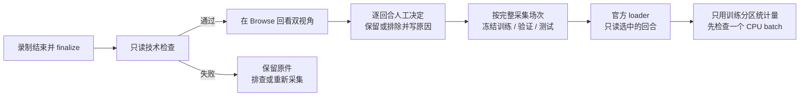

# 数据清洗：整理示范，不破坏原件

模仿学习需要的不只是“好看的视频”，而是**同一时刻的两路画面、机械臂状态、操作者动作和回合边界**。
单独剪掉 MP4 的几秒、改变播放速度或补一张末帧，都可能把动作标签与画面对错位置。

本项目的第一版清洗采用**整回合筛选**：原始 Dataset v3 不动，另存审核记录和训练清单。
筛掉是“不用于这次训练”，不是从磁盘删除。失败、中止和不确定结果仍有记录。

## 一眼看懂



| 层次 | 软件做什么 | 仍需要人判断什么 |
|---|---|---|
| 文件与同步 | 检查 MP4 解码、帧数、PTS、Parquet、回合边界、字段、profile、动作 trace | 画面里是否完整看到了任务 |
| 画面提示 | 每回合、每相机最多抽样 12 帧，记录明暗比例和拉普拉斯方差 | 是模糊还是低纹理？遮挡是否影响示范？ |
| 示范质量 | 保存 keep/exclude、结果、额外人工干预与理由 | 抓放是否成功、动作是否值得学习、任务是否一致 |
| 分区 | 整个采集 session 只能属于一个分区；训练统计不使用验证/测试回合 | 场景、日期、物体实例是否足够独立且有代表性 |
| 训练输入 | 本地 ACT 自动绑定冻结清单，验证原始字节未变；保存任务内清单与数据凭据 | 模型效果是否足够好，是否允许现场评估 |

图像指标只是提示，不是自动判废阈值。静止可能是在等待夹爪闭合，低纹理可能是纯色方块，
暗部可能是正常背景。当前不自动识别重复场景、所有模糊/遮挡，也不承诺发现每一个数据问题。

## 最快入口

双击项目根目录的 **`Start-SO101-Lab.cmd` → `8 Review training data`**。
依次使用 Inspect、Status、Label、Freeze；菜单只整理本地审核文件，不启动训练、连接机器人或上传数据。
也可以从项目根目录执行下面的 PowerShell 命令。

三色任务继续使用[三色分拣的专用标签与分区流程](TASK_COLOR_SORTING.md)，它还记录颜色、实例、布局、
未保存尝试等信息；通用审核不替代这些任务标签。普通 ACT 不会因为多了一条文字标签就获得语言条件。

### 1. 检查已完成的数据集

把示例 ID 替换成 Browse 中显示的真实 ID，不要复制示例去新建数据。

```powershell
.\.venv\Scripts\python.exe -X utf8 -m so101_lab.data_preparation_cli inspect local/my_demo
.\.venv\Scripts\python.exe -X utf8 -m so101_lab.data_preparation_cli status local/my_demo
```

- 必须先停止录制并完成 finalize。检查时不要续录或手工修改文件。
- 通过后所有回合初始为 `pending / unknown`，不会根据 Accept、Timeout 或“保存成功”猜测任务成功。
- 检查失败返回非零退出码，报告仍保存在本地；不会修复、补帧、删回合或启动训练。
- 本项目采集的 profile 与时序 sidecar 是必要证据；外部导入数据缺少它们时会阻断，不能补造记录。
- 命令打印本地报告位置。完整报告包括各回合各相机的抽样画面指标；Browse 显示轻量审核状态，
  不在每次打开页面时重新解码全部视频。

### 2. 回看，再记录人工决定

在 Browse 回看两路视频，注意夹取、搬运、释放与结束状态。界面 `Episode 7 of 7 · dataset index 6`
对应下面命令中的 `--episode 6`，不是 7。

```powershell
# 正常示教本身不算“额外人工干预”；例如另一只手帮执行臂放物体才算。
.\.venv\Scripts\python.exe -X utf8 -m so101_lab.data_preparation_cli label local/my_demo `
  --episode 0 --decision keep --outcome success --intervention no --reason "完整抓取并放入目标盒"

.\.venv\Scripts\python.exe -X utf8 -m so101_lab.data_preparation_cli label local/my_demo `
  --episode 1 --decision exclude --outcome failure --intervention no --reason "释放前物体掉落"
```

`outcome` 为 `success / failure / aborted / unknown`；`intervention` 为 `yes / no / unknown`。
保留决定需要已知结果和干预状态；排除也必须写理由。不确定时不要假填成功。
这版 ACT 训练只选训练场次中 **keep + success + 无额外干预** 的回合。
验证和测试场次中的失败/中止不会因 exclude 而从评价清单消失；验证 loss 不是任务成功率。

### 3. 冻结按场次分开的训练、验证、测试集

Status 会列出真实 `session_id`，以录制 sidecar 为准，不能重命名回合来伪造三个独立场次。
至少需要三个有数据的场次；一个场次的多个回合不够。

```powershell
.\.venv\Scripts\python.exe -X utf8 -m so101_lab.data_preparation_cli freeze local/my_demo `
  --validation-session SESSION_FROM_STATUS_B --test-session SESSION_FROM_STATUS_C
```

未指定的场次成为训练候选；同一选项可重复以选多个场次。所有已保存回合必须先完成人工决定。
训练分区不能为空；验证、测试必须各有数据。按 session 分开只是防泄漏的最低要求，
若同一天、同一摆放高度相似，仍需额外采集不同布局/光照/实例，并保持颜色与位置解耦。

### 4. 在原有 Training 页面使用同一个 ID

选择 Local、ACT 和准确 Dataset ID，保持图像增强关闭。后台会自动发现本地审核，
把冻结的回合、分区和统计来源传给固定版本的官方 parser 与 loader；不需要另造“清洗版 MP4”。
存在未完成审核、失败检查、被改动的原件或不匹配的配置时，任务在启动训练前被拒绝。
从未进入审核流程的旧数据仍保留原来的训练路径，**不会被自动宣称为已清洗**。

正式训练前先按[模仿学习设置](../README.md#模仿学习怎么设置)进行小 batch、短运行检查。
软件回归验证了合成视频/Parquet 的官方 CPU batch；它不代表你的每个真实回合已经人工验收。
审核工具本身不会替你启动训练。

## 预处理实际发生在哪里？

1. 官方 loader 按回合边界解码 H.264，提供双相机张量、状态和动作，按 Dataset 名义 FPS 取动作块。
2. 官方策略 processor 做张量转换与归一化；本流程只把 **训练回合** 的官方逐回合统计聚合到内存中，
   验证集使用同一组训练统计，测试集不加载。不会修改原来的 `meta/stats.json`。
3. 不改变 `arm` / `table_veiw`、六关节顺序、前五关节 degree 与夹爪 `0–100` 的单位；
   `action` 保持操作者目标，不替换成实测状态或限幅后的 `effective_sent`。
4. 默认不增加缩放、裁剪、重采样、去抖、颜色改变、灰度化或自动删除静止帧。
   特别是颜色分拣，Hue/灰度增强可能直接改掉学习目标。

Dataset 的 `frame_index / fps` 不是相机曝光时钟。时序 trace 能提供主机循环/到帧诊断，
但不能把多相机近似关联升级成硬件同步。见[字段与时间合同](DATA_CONTRACTS.md)。

## 版本、恢复与换电脑

审核保存在 `.local/evidence/recordings/preparation/<id-hash>/`，不进 Git：

- `audit.json`：技术检查、视频窗口与抽样提示；
- `review.json`：每个回合的人工决定与原始数据身份；
- `split.json`：冻结分区及对应审核快照；
- `history/`：修改或重新检查前的旧版本。

冻结后不能直接改标签。新增录制或要调整决定时，显式运行 `inspect ID --refresh`：
旧版本归档，新版重新审核，不沿用可能过期的成功判断。失败 refresh 也会撤销当前训练准入。
旧训练任务保留自己的快照；原始字节变化后不能把它当作原任务无缝 resume，应建立新的训练任务。

迁移时私下复制 Dataset、该数据集的 profile、原有 session sidecars 与 preparation 文件，保持相对结构。
原始数据身份由相对文件名和内容构成，不依赖旧电脑绝对路径。新电脑仍先 Setup、Check、Browse、Inspect/Status，
再验证官方读取。仅 clone GitHub 不会带来视频、人工标签、模型或校准。
Windows 建议使用较短的项目/数据根目录，避免系统或复制工具的长路径限制；历史记录使用扁平短文件名。

## 目前边界与下一步

| 当前已实现 | 有明确需求后再做 |
|---|---|
| 本地完整性审计、画面数值提示、人工整回合筛选、冻结分区、训练集统计与训练准入 | 同步裁剪视频+Parquet 的独立派生数据集，必须保留原回合/帧映射并全量重验 |
| 入口菜单、命令行决策、Browse 状态说明 | Browse 内逐回合交互标注与可视化指标；当前不是一键网页清洗器 |
| 单个 Dataset ID、ACT、固定相机/单位、本机只读处理 | 多数据集混合、跨帧率重采样、专用纠错示范策略，需单独设计 |

技术损坏目前阻断整个数据集的准入，即使你把某回合标为 exclude，也不能绕过坏媒体/坏索引。
这保留了明确的失败边界；若要挽救完整回合，应另外创建经过审核的官方派生 Dataset，而不是手改原件。
通用清单覆盖已保存回合；未保存尝试仍以原始 sidecar 为准，不凭已保存数量计算完整现场成功率。

## 实现参考

- [LeRobot 官方数据工具](https://huggingface.co/docs/lerobot/en/using_dataset_tools)：提供回合选择、分割等工具。
  文档随上游变化；本项目以固定源码为准，不自动升级。某些编辑命令默认会改原数据，本流程不调用它们。
- [固定 LeRobot 数据工厂](https://github.com/huggingface/lerobot/blob/30da8e687a6dfc617fcd94afc367ac7071c376ce/src/lerobot/datasets/factory.py)：
  复用官方按 episode 读取的入口，仅适配冻结 session 分区和训练统计来源。
- [robomimic 数据结构与 filter keys](https://robomimic.github.io/docs/datasets/overview.html)：
  用示范 ID 的筛选清单组织训练/验证。这里借鉴“选择记录与原始轨迹分离”的思路，不转换成它的 HDF5 格式。
